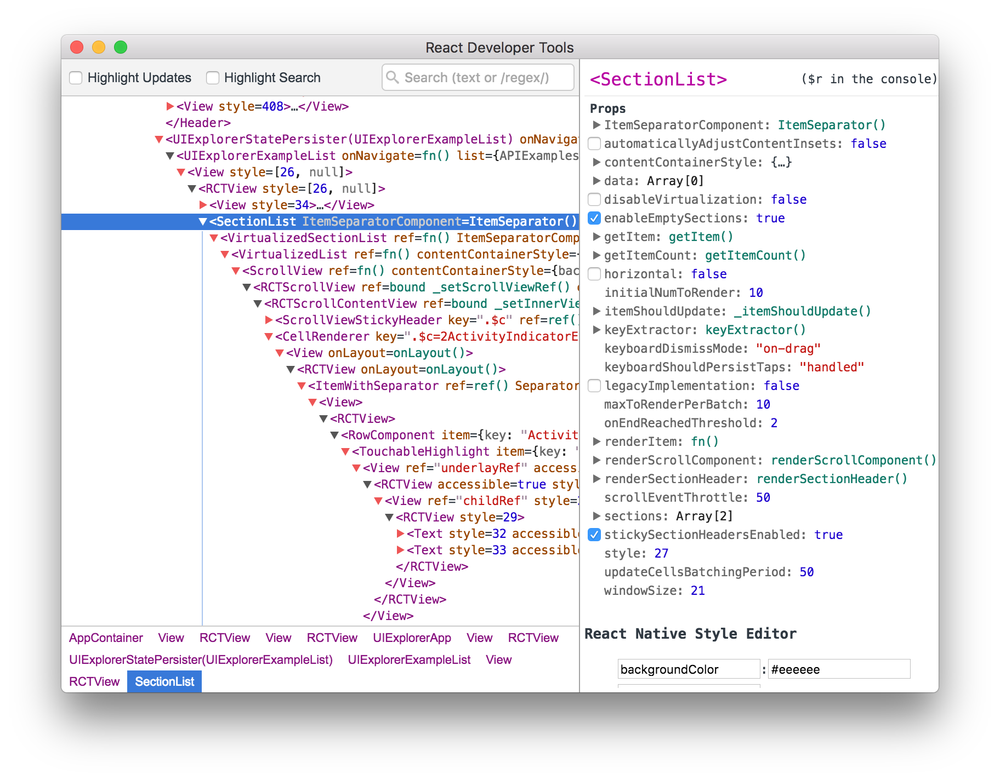

Here is a list of React tips and things that I think especially beginner React developers will find useful. I have found that many of these are often misused or people don't know about them. So let's dive right in.

## 1. Passing props as strings instead of numbers

If your component has a prop that is number you should pass the value as number and not as a string. If you pass it as a string you need to use something like parseInt() in the component before you can use it as a number. You can use curly braces to pass a value as a number.

```jsx
// Not like this
<MyComponent oddNumber="3" />

// Like this
<MyComponent oddNumber={3} />
```

## 2. Everything that changes the state should be done with setState

When changing a component's state, it should always be done with setState method. You never want to modify state directly e.g. like this `this.state.value = 20`. Only place where you can modify state directly is in the constructor when you assign the initial value for the state.

## 3. setState function is asynchronous

Calling setState function updates the state asynchronously. This means that when setState is called, the state is not guaranteed to be updated right away. It is not a good practice to read `this.state` right after calling stetState because the state might not yet be updated to the new value.

## 4. Don't use this.state inside setState

This is related to the previous one. It is not reliable to use this.state inside setState function. If you want to update the state based on the previous state, updater function should be used. setState accepts an updater function as a parameter and previous state is passed to it.

```jsx
// This is not reliable
this.setState({ counter: this.state.counter + 1 });

// You should use the updater function, like this
this.setState((prevState) => {
  return { counter: prevState.counter + 1 };
});
```

You can find detailed explanations on how setState works from the [React docs](https://reactjs.org/docs/react-component.html#setstate).

## 5. React developer tools



React developer tools is a very handy tool that enables you to inspect your application's components including their state and props. It can be installed as an extension for Chrome and Firefox or as a standalone application.

Chrome: [https://chrome.google.com/webstore/detail/react-developer-tools/fmkadmapgofadopljbjfkapdkoienihi](https://chrome.google.com/webstore/detail/react-developer-tools/fmkadmapgofadopljbjfkapdkoienihi)

Firefox: [https://addons.mozilla.org/en-GB/firefox/addon/react-devtools/](https://addons.mozilla.org/en-GB/firefox/addon/react-devtools/)

Standalone: [https://github.com/facebook/react-devtools/tree/master/packages/react-devtools](https://github.com/facebook/react-devtools/tree/master/packages/react-devtools)

## 6. Use create-react-app or codesandbox.io

The initial configuration required for a project before you are able to write actual React code can be overwhelming. This is why you should use preconfigured solutions like [create-react-app](https://github.com/facebook/create-react-app) or [codesandbox.io](https://codesandbox.io/). They take away the need for build configurations and are ready to use right away.

With create-react-app you can create a new React app with few commands and you are ready to start coding. You can get started immediately and not worry about installing and configuring things like Webpack or Babel. They are preinstalled and preconfigured and hidden so your focus can be 100% on the code.

Other great option is codesandbox.io. You can read a more comprehensive post on it [here](/blog/online-code-editor-every-web-developer-should-know-about/), but in short it is a code editor for your browser where you can create projects that are called sandboxes. You can then choose to setup your sandbox with React configuration so you don't have to worry about the tools and configurations either and you can start to write React code right away.

## Wrapping up

I hope at least some of these tips were helpful for you. If you think I missed some crucial thing be sure to drop a comment below!

Remember to subscribe to CodePulse newsletter, if you haven't already, to stay tuned on the latest news and posts about modern web development. Newsletters go out usually max once a month and you can unsubscribe anytime you want.
