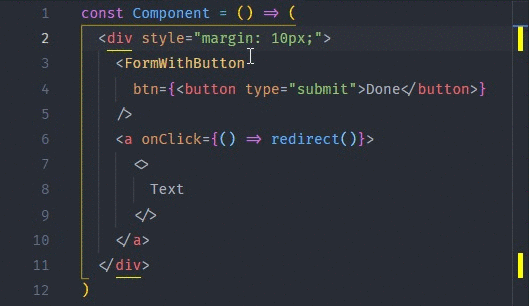

A while back I shared my favourite VS Code extensions exclusively to the [CodePulse newsletter](/newsletter) subscribers. I now decided to share them with all of you!

_If you are not yet subscribed to the newsletter, be sure to [do it now](/newsletter)! Doesn't cost you anything._

I've been using VS Code quite a while now and even though the plain editor is great, there is plenty of useful extensions that you can install to make it even better. Here are some of my favourites.

### GitLens

GitLens supercharges the Git capabilities built into Visual Studio Code. With it you can easily and fast see who/when/why given code was added which gives you better understanding of the code at hand. I absolutely love this extensions since I no longer have to browse through Git logs or commits to find when part of the code was added and who committed it.

You can find it from the Visual Studio Marketplace: [https://marketplace.visualstudio.com/items?itemName=eamodio.gitlens](https://marketplace.visualstudio.com/items?itemName=eamodio.gitlens)

### Highlight Matching Tag

This extension helps in matching opening and closing tags. I have found it very handy especially with larger components and elements that have many nested elements inside of them.

You can find it from the Visual Studio Marketplace: [https://marketplace.visualstudio.com/items?itemName=vincaslt.highlight-matching-tag](https://marketplace.visualstudio.com/items?itemName=vincaslt.highlight-matching-tag)

### Settings Sync

Useful if you have multiple computers you work on. This extension synchronizes settings, snippets, tehems, file icons, launch, keybindings, workspace and extensions across multiple machines using GitHub Gist.

You can find it from the Visual Studio Marketplace: [https://marketplace.visualstudio.com/items?itemName=Shan.code-settings-sync](https://marketplace.visualstudio.com/items?itemName=Shan.code-settings-sync)

### Import Cost

For me this is in some projects a lifesaver. When you need to make your bundle as small as possible this extension is very handy. It will display inline in the editor the size of the imported package. The extension utilizes webpack with babili-webpack-plugin in order to detect the imported size.

You can find it from the Visual Studio Marketplace: [https://marketplace.visualstudio.com/items?itemName=wix.vscode-import-cost](https://marketplace.visualstudio.com/items?itemName=wix.vscode-import-cost)

* * *

Do you think I missed some? Comment below your favourite extensions!
