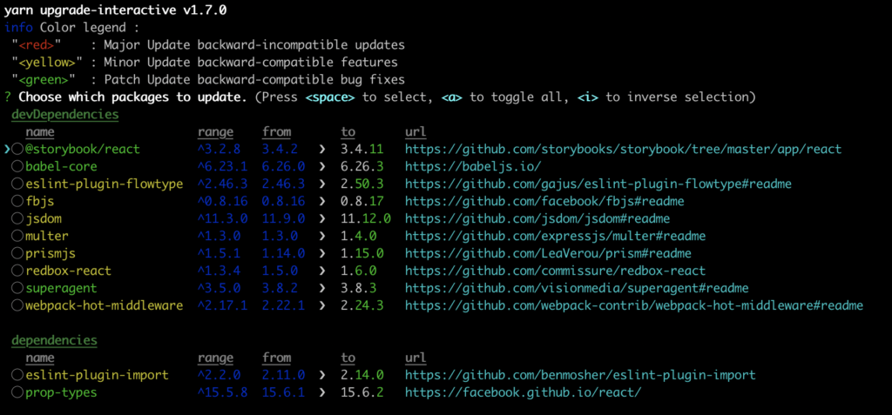

In Javascript projects it is important to keep your dependencies up to date. Updating dependencies should be done regularly so you don't end up in a situation where you have all your packages several major versions old. So what is the best way to update javascript dependencies? I like to use `yarn updgrade-interactive`.

## Update Javascript dependencies with yarn upgrade-interactive

[Yarn](https://yarnpkg.com/) provides a handy command for updating your packages – `yarn upgarde-interactive`. It prints all the outdated packages and lets you choose which ones to update. It will respect the version ranges set in your package.json file.

Running `yarn upgrade-interactive` does not update your package.json file with the new version number. This is quite logical if you think about it. Since it will respect the version ranges in the package.json file, there is no need to update the version to package.json. Because if `yarn install` is ran for a fresh install, the newest package for that version range is installed = same version that `yarn upgrade-interactive` installs.

## Using --latest flag

If you wish to install the latest version that is found from the npm registry, you can achieve this by using `--latest` flag with `yarn upgrade-interactive`. It will make yarn ignore the version ranges in package.json file and install the latest version of given package. This will also update package.json file with information of the new versions of the updated packages.
