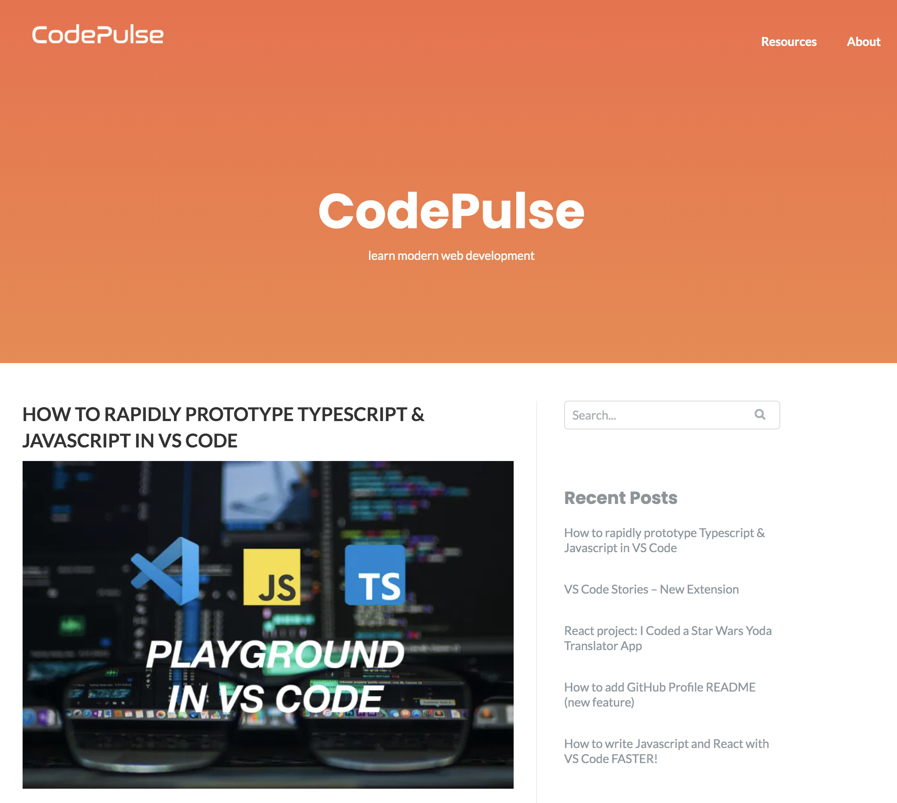
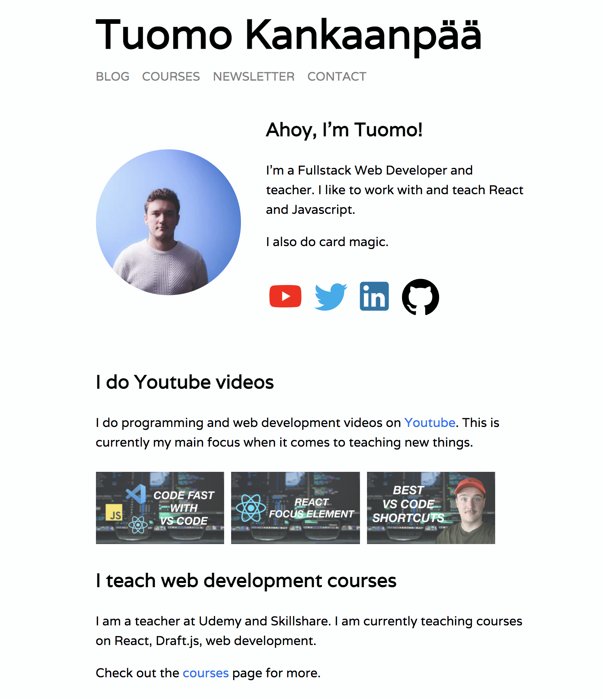

First of all, Happy New Year!

I have been blogging for about three years now. Back in 2018 when I first started, I created a Wordpress blog and gave it a name CodePulse.blog. This blog has also served as my personal website but the main focus has been on the blog though.

Now, three years later, I decided that I want to update the blog and website. In the process I decided to move the blog under my own name. So from now on you find my blog and website from [tuomokankaanpaa.com](https://www.tuomokankaanpaa.com).

I have coded the new website on my own using JAMstack and I no longer use Wordpress. I had such a good time working on this new website and I learned a bunch of new stuff along the way. I will be writing more detailed explanation of the process, so [go and subscribe](/newsletter) to my email newsletter so you don't miss those posts.

That's all for now. I am excited of this upcoming year and I have lots of stuff planned, so stay tuned!
