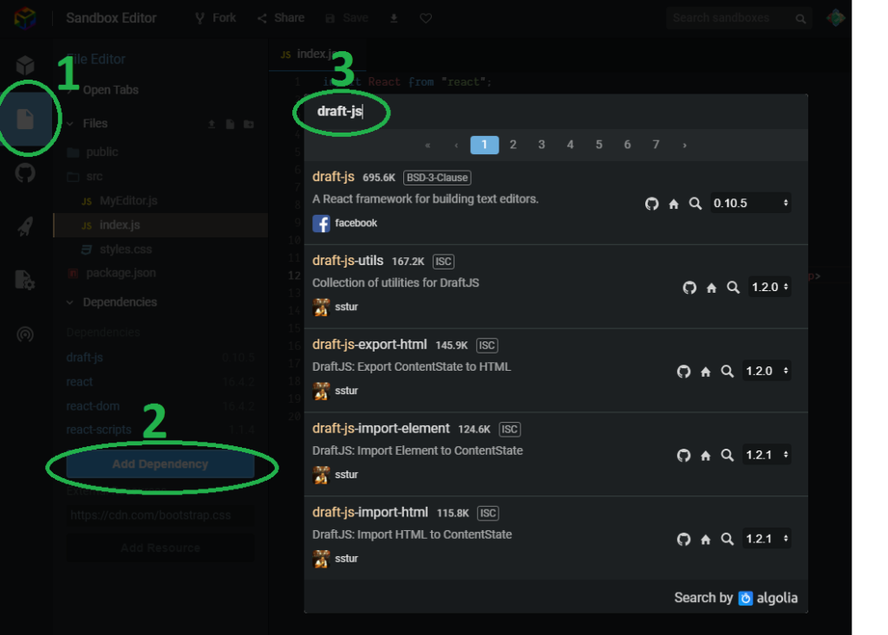
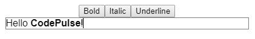

[Draft.js](https://draftjs.org/) is an open source library for handling rich text editing with React.

Draft.js handles the storing of the editor state (e.g. text, transformations and undo/redo stack) by storing everything into an EditorState object. It is a complete snapshot of the editor state.

EditorState object itself maintains the undo/redo stack of the editor. This stack is comprised of ContentState objects.

ContentState object represents the contents of the editor (e.g. text, entity ranges and inline styles) and selection states before and after rendering the contents.

_Entity ranges is something we won't be touching on this post but if you wish you can read more about them from the [documentation](https://draftjs.org/docs/advanced-topics-entities)._

I believe that best way to learn is just start doing so let's dive in and create a basic editor component.

_I just published a class where I teach more about Draft.js. Best part is that you can get it for free! [Read more](/blog/rich-text-editing-in-react-with-draft-js-course/)._

### Basic Draft.js editor usage

We are going to make a React component with a Draft.js editor that has basic bold, underline and italic rich text editing functions. I am going to use [codesandbox.io](/blog/online-code-editor-every-web-developer-should-know-about/) for this example. You can find the finished sandbox for this tutorial [here](https://codesandbox.io/s/1z4vl0wz13?module=%2Fsrc%2FMyEditor.js). Go ahead and fork it so you can make changes, follow along and play around with it.

First off we need to add Draft.js to our project. In codesandbox you can do this by opening the "File editor" tab from the left and under "Dependencies" click "Add dependency" and search for draft-js.



Now let's add a new file `MyEditor.js` which will hold our editor component.

In the `MyEditor.js` file let's type in the following:

```jsx
import React, { Component } from "react";
import { Editor, EditorState } from "draft-js";

const wrapperStyle = {
  border: "1px solid gray", // add some border
  width: "400px", // set fixed width
  margin: "auto", // aligns the component in the middle
  textAlign: "left", // start the text from left hand side
};

class MyEditor extends Component {
  constructor(props) {
    super(props);
    this.state = { editorState: EditorState.createEmpty() };
    this.onChange = (editorState) => this.setState({ editorState });
  }

  render() {
    return (
      <div>
        <div style={wrapperStyle}>
          <Editor
            editorState={this.state.editorState}
            onChange={this.onChange}
          />
        </div>
      </div>
    );
  }
}

export default MyEditor;
```

This will render an instance of Draft.js editor and add some styling for the wrapping div. As you can see we are importing `Editor` and `EditorState` from the draft-js library. `Editor` is the actual component for the editor and `EditorState` is a top-level state object for the editor.

In the constructor we want to define a state for the component. We will store the state of the editor in an `editorState` variable. We initialize it with `EditorState.createEmpty()` because it must be a valid `EditorState` object and `EditorState.createEmpty()` returns a new `EditorState` object with an empty `ContentState` and default configuration.

Because the editor will be a controlled component, we need to define `onChange` function for it. We define it in the constructor and in it, we will update the component's state with new `editorState` object.

In the component's render method we render the `Editor` component with `editorState` and `onChange` props. The editor should now look like this.


We now have a working editor component but we don't yet have any rich text editing functionality in it. So let's add the **bold**, _italic_ and underline commands to our editor.

Here is the updated code for the `MyEditor.js` component that includes the functionality for bold, italic and underline features. The changes are highlighted.

```jsx
import React, { Component } from "react";
import { Editor, EditorState, RichUtils } from "draft-js";

const wrapperStyle = {
  border: "1px solid gray", // add some border
  width: "400px", // set fixed width
  margin: "auto", // aligns the component in the middle
  textAlign: "left", // start the text from left hand side
};

class MyEditor extends Component {
  constructor(props) {
    super(props);
    this.state = { editorState: EditorState.createEmpty() };
    this.onChange = (editorState) => this.setState({ editorState });
    this.handleKeyCommand = this.handleKeyCommand.bind(this);
  }

  handleKeyCommand(command) {
    const { editorState } = this.state;
    const newState = RichUtils.handleKeyCommand(editorState, command);
    if (newState) {
      this.onChange(newState);
      return true;
    }
    return false;
  }

  render() {
    return (
      <div>
        <button onClick={() => this.handleKeyCommand("bold")}>Bold</button>
        <button onClick={() => this.handleKeyCommand("italic")}>Italic</button>
        <button onClick={() => this.handleKeyCommand("underline")}>
          Underline
        </button>

        <div style={wrapperStyle}>
          <Editor
            editorState={this.state.editorState}
            onChange={this.onChange}
            handleKeyCommand={this.handleKeyCommand}
          />
        </div>
      </div>
    );
  }
}

export default MyEditor;
```

So first we import `RichUtils` module from the draft-js library. It contains a set of utility functions for rich text editing.

We pass `handleKeyCommand` prop for the `Editor`. This will allow us to handle the key commands.

In the `handleKeyCommand` method, we use `RichUtils.handleKeyCommand` function to apply the given command for the current `editorState`. The command is a string e.g. "bold", "italic" or "underline". The `RichUtils.handleKeyCommand` function will take care of applying the given style to the `editorState`. Note that in order for "`this`" to work inside `handleKeyCommand` method, we need to add the following line to the constructor:

this.handleKeyCommand = this.handleKeyCommand.bind(this);

We also need to return true / false from the `handleKeyCommand` method so that the editor knows if the command was handled or not.

Finally we add three buttons in the render method that when clicked, call the `handleKeyCommand` method with appropriate command. Note that the commands must be lowercase.



That's it! Now we can highlight text and use either the buttons or the keyboard shortcuts (ctrl/cmd+B, ctrl/cmd+I, ctrl/cmd+U) to apply styles to the text in the editor.

### Conclusion

We went over how to create a component that handles rich text editing using Draft.js. As we saw, adding rich text editing to React component is not that complicated. Hopefully this tutorial helped you in getting started with Draft.js. If you have any questions or comments be sure to drop them into the comment section! All comments are appreciated!

### Want to know more?

I have also written about [How to display Draft.js content as HTML](/blog/how-to-display-draft-js-content-as-html/) and [How to store Draft.js content](/blog/how-to-store-draft-js-content/). So be sure to check those out too!
