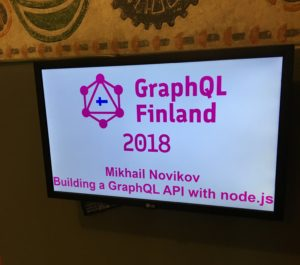
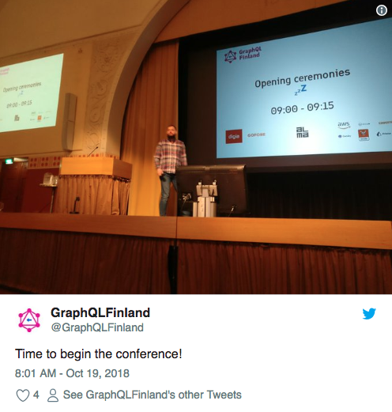

I attended GraphQL Finland which was held little over a week ago (Thursday & Friday 18-19.10.2018) in Helsinki at Paasitorni. The first day was for workshops and the second day for the actual conference. So the structure was similar for [React Finland](/blog/react-finland-2018/) with the difference that React Finland had two days of talks instead of one.

At Thursday, which was the workshop day, I participated [Mikhail Novikov](https://www.freiksenet.com/)'s "Building a GraphQL API with node.js" workshop. It was very beginner friendly, which was nice because I am quite a noob when it comes to GraphQL. It was a whole day workshop lasting 7-8 hours. After the workshop I felt that I understood the basics of GraphQL pretty well and I was pumped with motivation for the actual conference day of GraphQL Finland.

There was also a little informal get together at Thursday evening. It was great to see that many people who came to Helsinki on Thursday, either for workshops or just for the conference, decided to get together for some food and drinks at Thursday evening. We had interesting conversations and it was great to meet some GraphQL people before the actual conference.

Friday was full of talks and quite a few interesting ones. I think the talks were good mix of more advanced stuff and then again something for more of beginners like me. I had few "ahaa" moments and really enjoyed listening the talks and taking it all in.

Overall the conference gave me a good picture of what GraphQL is about and ideas on where and how to use it. I also got a lot of motivation and met great people during the conference, which is always nice!
