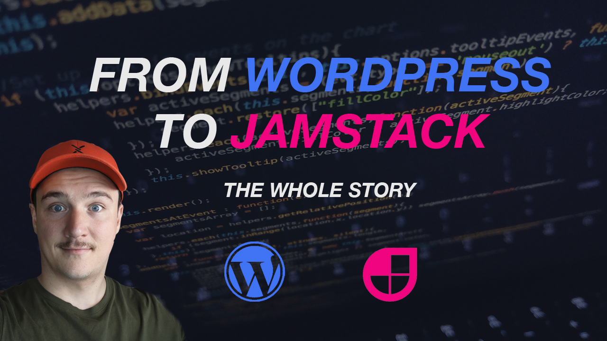
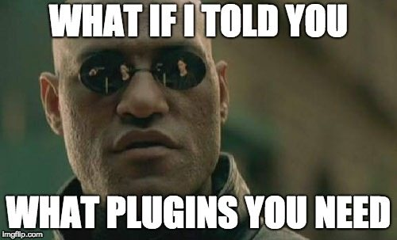
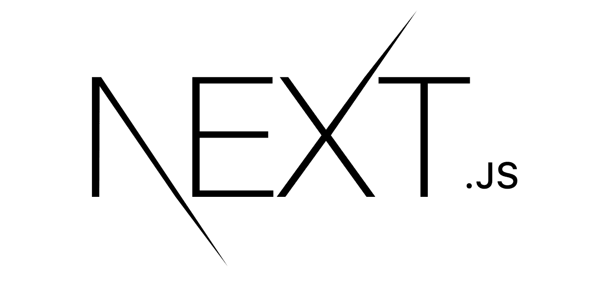
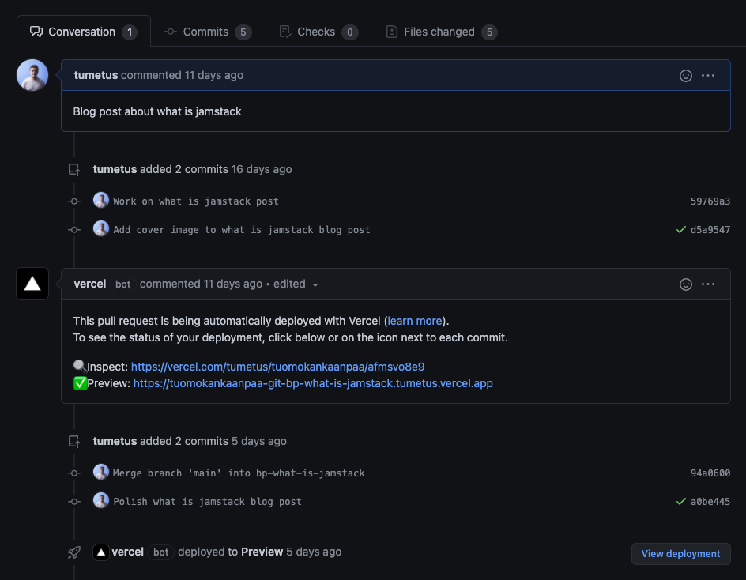
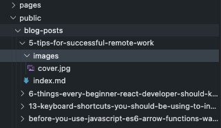
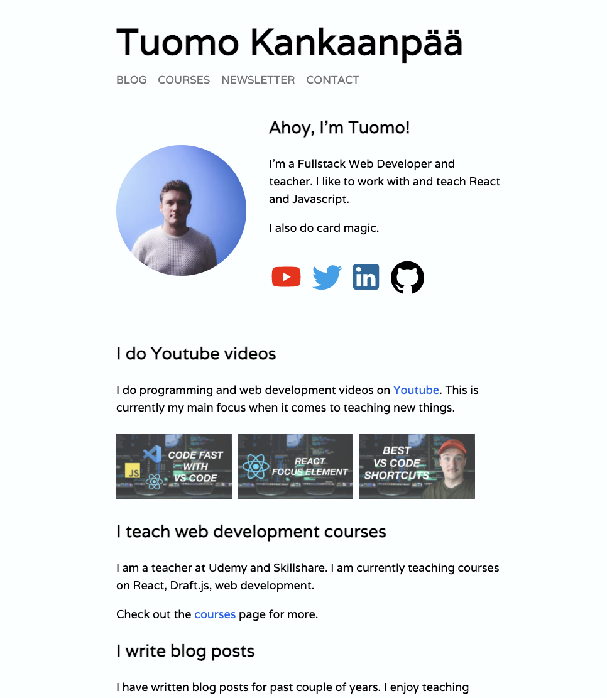

It's 2021 and it has been over three years since I started blogging. When I started I bought a domain and webhotel from [Bluehost](https://www.bluehost.com/track/tume/bpfromwptojamstack) and build my blog on top of Wordpress. I came up with a name for my blog; codepulse.blog. To this date I have more or less consistently writed articles to that blog. But lately I got this idea that maybe it is time to update the blog a little bit.

# Desires - What I want from my new blog / website

When thinking about updating my website I first thought that maybe just a fresh theme would suffice but then I decided to go a bit further. So after thinking things through here is what I decided I wanted to change in my blog.

- Change the name to my own name (codepulse.blog -> tuomokankaanpaa.com)
- I want to write my blog posts as markdown
- Get rid of Wordpress and code the blog myself (after all I'm a web developer)

Let's break down each topic and let me shed a light on why I wanted to do each of these changes.

## 1. Changing the blog name

While codepulse.blog has served well for the past couple of years, I want to create a website that serves not only as a blog but also a portfolio site and a site where I can showcase things that are related to me e.g. my courses. I also started a [Youtube channel](https://www.youtube.com/channel/UC34UXFLKqdW3cpk5CBu2Siw) last year, and the channel is on my own name, so it is natural that the blog is also under my name.

I was hesitant at first, because I have quite a few posts that at the moment rank well in Google search results. But after some research I found that as long as I create redirects correctly (301 and not 302) from codepulse.blog domain, there shouldn't be any harm and Google should understand that the site is the same site but with different name.

I also had to "tell" Google that my site had moved. This could be done in the Google search console and there is good instructions on Google's site for that.

_Here is a good blog post about things to consider when changing site url: [How to change your site’s domain name (URL) without losing SEO rankings](https://www.foregroundweb.com/site-url-change/)_

## 2. I want to write my blog posts as markdown

I love markdown. It is just wonderful to write content as markdown.

I often crosspost my blog posts to [dev.to](https://dev.to/tumee) and they require you to write the posts in markdown, which is great. But it is always quite a work to make the blog post look good in Wordpress and then tinker it to display well (links, images, etc) in dev.to too.

Even though the (new) editor in Wordpress, Gutenberg, understands markdown pretty well, it's not quite what I want. You can copy/paste markdown into the editor and it will display the contents pretty well. But there is almost always some small things that doesn't display correctly and you have to correct them manually. And if you want to edit the content, you have to do it in the Gutenberg editor.

If I have my blog posts as markdown files, I can edit them with my favourite text editor, VS Code. I do all my coding with VS Code so I spend a better part of my day using VS Code and I am super familiar and comfortable with it. So it is just a big plus if I can also write my posts with VS Code.

_See also: [Top 10 Keyboard shortcuts for Visual Studio Code in 2021](https://www.youtube.com/watch?v=9Jo084i0Dzs)_

## 3. Get rid of Wordpress and code the blog myself

If I were to start blogging from scratch right now, I would definately just sign up for a shared hosting plan on a site like [Bluehost](https://www.bluehost.com/track/tume/bpfromwptojamstack) and start building my blog on top of Wordpress. (Read more on why: [Why you should NOT code your own blog when starting blogging](/blog/why-you-should-not-code-your-own-blog-when-starting-blogging))

But since I have been using Wordpress for couple of years now, there is some aspects that when starting blogging out, are totally fine, but have grown on me over the time and resulted for my desire to switch away from Wordpress and code the blog by myself.

### Slowness

First of them is that Wordpress is sometimes a bit slow. When opening a post for editing or saving a draft and previewing it, it takes quite a bit of time. Especially when I am used to almost instant live reloads when writing code.

The slowness is also visible when browsing the site. It is not too bad, but in 2021 people's attention span is shorter than ever and if we are talking about more than 2 seconds for a page load, it is not good.

All this is partly result of the fact that Wordpress is built on PHP, which is request lifetime language. Meaning that when ever a request hits the server, php starts up and generates the data (opens db connection, read files etc.) that will be sent to the browser (= HTML). And that inevitably takes time.

### Customising

Secondly I want to have more control over my site. I am a web developer so making websites is what I do. With Wordpress however I need to first understand how Wordpress works. Then figure out how to edit things and then do the editing using php and maybe some templating language. To be honest I have only used the Wordpress editor when designing my blog and haven't taken a look under the hood at all. So I am not sure how I would go about editing the site and don't really have the interest to find out either.

I write React a lot when coding other things and it would be easy for me to also write and customise my site using that. So having the blog written in React would be ideal.

### Plugins



Most of the time when I need to add some custom functionality to Wordpress site, it is done with plugins. I am not sure if this is just me or is this a familiar thing to other Wordpress bloggers too, but I don't know what half of the plugins on my site do.

The list of installed plugins is long and I am not sure if I can uninstall some of them without breaking things. And if I need to update a plugin, I always have my fingers crossed that it would not break anything. This is probably something that could be averted by better maintenance but hey, I guess I am just a bit lazy.

# Migrating old posts to the new blog

All of my existing posts were in my Wordpress database and in the new blog I needed them in markdown. So I needed to find a way to convert the blog posts from Wordpress to markdown. Luckily, Wordpress being as popular and used as it is, I wasn't the first one with this need. So I found just the tool for the job: [wordpress-export-to-markdown](https://github.com/lonekorean/wordpress-export-to-markdown).

I just needed to download an export of my Wordpress blog and run the _wordpress-export-to-markdown_ tool which then parsed all of the blog posts from that dump. As a result I got all my posts and images nicely ordered in folders by blog post.

The _wordpress-export-to-markdown_ did most of job but I still had to do some manual work and go through each post e.g. fixing image links, extra backslashes and change internal links to point the new domain. This part was a bit tiring, because it was manual work, and took me few hours. But once it was done, I got all my existing blog posts nicely in markdown files in their respective folders.

# Coding the new blog and website

Ok so now that I knew what I wanted from my new blog and website, it was time to start researching how to code it.

Soon after I started to think about the idea of coding the blog on my own, I came across Jamstack. This was something new to me and when I fiddled around with it for a while, it came clear to me that this would be the architecture I was going to use for the new blog.

_Don't know what Jamstack is? No worries! Check out [this](/blog/what-is-jamstack) blog post to learn more!_

It checked all the boxes I had for the new blog. It is super fast, you can have the blog posts in markdown and since the site is pre-rendered, it can be deployed to just any webserver. And I have total control over the design of the site.

Okey I got to be honest here, my design skills are not cutting edge, so I decided to concentrate on making the blog and website clean and simple. Nothing too fancy. And the fact actually is that I personally enjoy reading coding blogs that are fast, simple and clean and concentrate on displaying the content clearly rather than having super fancy css animations or such. So main things for me were the speed, simplicity and clearness.

## Choosing a site generator



After some research I concluded that it would be best to use a static site generator for my project. There is a [bunch of options](https://jamstack.org/generators/) to choose from when it comes to site generators for Jamstack.

I played around with few of them and decided to go with Next.js. Next.js is open source React framework built by Vercel. With it I can use React and TypeScript and as it happens, on their [online tutorial](https://nextjs.org/learn/basics/create-nextjs-app) they teach how to build a blog with blog posts in markdown files!

This tutorial was of great help (thanks Next.js team!) and I got a great foundation on which to start building my own blog.

## Getting to coding

I am fluent with React and working on my Typescript. Next.js is a React framework so that worked more than well for me.

I could have used plain Javascript with Next.js but because I am into learning more Typescript, I thought that this might be a good chance to get some Typescript excercise, so I chose to use Typescript.

When it comes to code formatting, I didn't want to have messy looking code in my project. So from the get go I decided to use [Prettier](https://prettier.io/) for code formatting.

I hooked it up with VS Code so that on every file save Prettier would fire up and format the code in that file. This way I would have consistently formatted code throughout the project.

## Challenges

As we all know, a software project is never without it challenges. And this was not an exception.

One thing that I was trying to figure out for a long time was where to place my blog post markdown files.

I fiddled around with couple of options:

- Placing .md files in the /pages/posts folder
- Placing .md files to a separate Github repo
- Placing .md files inside the /public folder e.g. /public/blog-posts

### Placing .md files to /pages/posts

The tutorial placed the .md files to /pages/posts folder and I tried this at first too. This didn't work for me though, because I wanted to have a folder for each blog post in which I have the .md file and all images related to that post.

### Placing .md files to separate Github repo

Next I tried creating a new repository to Github. In that repository I had a folder for each blog post. I would then read the blog posts from that repository instead of reading them from local files. This worked well with images too because I could reference the images relatively in the .md files (e.g. /images/cover.jpg) and when I loaded the posts data with Next.js, I would convert the links to absolute links pointing to the files in the blog posts Github repo (thanks to [maxime1992](https://github.com/maxime1992/my-dev.to)).

I also added a Github action which triggered whenever the blog posts repo got new commits. The action would call a Vercel web hook that in return would trigger a rebuild thus updating the blog with new post data.

The downside of this was that the development experience got worse. Since we were now loading the posts data over the internet every time we build the site (aka in development everytime you refresh the page) this increased the build time significantly. I'm not sure if there is a solution for this kind of problem with Next.js but at least I didn't come across one.

### Placing .md files inside the /public folder

So after going back and forth with different options, I ended up placing the blog-posts folder inside the /public folder. This way the posts data was stored locally making it fast to build the application.

I was also able to place all blog post related images to a images folder inside each blog post folder (e.g. `public/blog-posts/how-to-focus-element-in-react/images`). Now I could reference the images easily with relative syntax e.g. `./images/cover.jpg`.

This didn't work out of the box though because if I did this the image path would be something like `www.example.com/images/cover.jpg`. So I utilized code from [maxime1992/my-dev.to repo](https://github.com/maxime1992/my-dev.to) and added the slug of the blog post infront of the image src when loading the data.

## Hosting


I previously had used [Netlify](https://www.netlify.com/) for hosting couple of my projects. By using Next.js I came across to [Vercel](https://vercel.com).

Vercel offers among other things hosting of Next.js applications to a certain point for free. I was amazed how easy they had made deploying Next.js applications to production.

Only thing I needed to do was to log into Vercel, link my Github repo to a Vercel project and that's it. I right away have my application deployed to production from Github and when I push new code to my main branch on Github, it is automatically deployed to production!

Another super cool feature is that if I open a pull request to my Github repository, Vercel automatically creates a preview build of the pull request, which I can right away test out and share a link to.



All this with only linking the Github repo to a Vercel project. Pretty easy and effortless I'd say. So since Next.js and Vercel work so well together, I decided to host the application with Vercel.

# Posting a new blog post

As I mentioned before, I build the blog so that in my `public` folder I have `blog-posts` folder. Each folder inside this folder is a single blog post. So if I want to add a post, I create a new folder and inside that folder I create a markdown file that holds the content of the post.

The blog post folder name is used as the slug for the post so if I for example have a folder called `how-to-focus-element-in-react` inside the `public/blog-posts` folder, that post can be read with url `/blog/how-to-focus-element-in-react`.



So in order to add a new blog post, I would need to create a new folder with .md file inside of it. The .md file would also always have the same meta information fields (title, excerpt, tags, etc.). So to make things easier, I created a script that generates a new folder and markdown file for a given slug.

```jsx
const fs = require("fs");
const path = require("path");

// Get paramas
const params = process.argv.slice(2);
// First param is the slug
const slug = params[0];
if (!slug) throw new Error("Please provide a slug as a first parameter");

const blogPostFolder = {
  fullPath: "public/blog-posts",
  folderName: "blog-posts",
};

const postDirectory = path.join(
  process.cwd(),
  blogPostFolder.fullPath,
  `${slug}`
);

const mdTemplate = `---
date: "2020-05-26"
title: ""
excerpt: ""
tags: "tag1,tag2,tag3"
slug: "${slug}"
coverImage: "cover.jpg"
description: "<insert meta & og description here>"
---
`;

if (!fs.existsSync(postDirectory)) {
  fs.mkdirSync(postDirectory);
  fs.mkdirSync(path.join(postDirectory, "images"));
  fs.writeFile(postDirectory + "/index.md", mdTemplate, (err) => {
    if (err) throw err;
    console.log("Blog post folder created");
  });
} else {
  console.log("Blog post folder with that name already exists.");
}
```

Now when I want to create a new blog post, I can use the script to generate the folder and markdown file and then write the post to the markdown file.

Once I am ready to publish the post, I can simply commit the changes to my main branch (or create a PR) and push the main branch to Github (or merge the PR to main branch). After this Vercel will automatically detect that there is changes in the main branch and trigger a deploy and the new post will be visible in production in a minute or two.

# Final thoughts



The site is now live and you can find it in [tuomokankaanpaa.com](https://tuomokankaanpaa.com).

All the code for the project is available on [Github](https://github.com/tumetus/tuomokankaanpaa).

I have used the new site about a month now and published couple of blog posts already.

I have noticed that it is easier and much more fun to write the posts now. I think this change has really increased my productivity and made writing these posts much more enjoyable.

The project was also good one in terms of practice and learning Next.js and using Vercel automatic production & preview deploys.

I think that because the project I built was a website for myself and I knew that it would be used and not just sit on my Github account as "another side project", I was motivated to finish it and in the process learn things that were required for getting a project from an idea to production.

If you enjoyed this post, consider signing up for my [newsletter](/newsletter) for more content like this.

Thank you for reading!

_Disclosure: As an Bluehost affiliate partner I earn from qualifying purchases._
