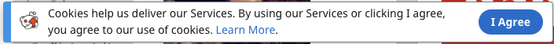

Nowdays almost every website you visit for the first time displays a banner, stating something like "you must agree to use of cookies in order to continue using the website". Even though these are most of the time just annoying, if you have a website that uses cookies, you pretty much need to have this on your site too.



In this blog post I want to show you how to easily and quickly add this "cookie consent banner" to your own React application. I used this same way when I added cookie notice banner to my own website.

> _Read more on [How I converted my website from Wordpress to Jamstack](/blog/how-i-converted-my-website-from-wordpress-to-jamstack)._

## react-cookie-consent

There is no need to re-invent the wheel. We can use npm package [react-cookie-consent](https://www.npmjs.com/package/react-cookie-consent) to do most of the heavy lifting for us.

So to get started open up your React app and install `react-cookie-consent`.

```
npm install react-cookie-consent
```

Next we need to import `CookieConesnt` component from `react-cookie-consent`. Add the following code to your component.

```jsx
import CookieConsent from "react-cookie-consent";
```

Then add the actual component to your render method.

```jsx
<CookieConsent>This site uses cookies.</CookieConsent>
```

The `CookieConsent` component accepts `debug` prop. When we are in development, we can set this `true` and this way the banner will be displayed every time you refresh the site. Just remember to remove it when you are done developing and about to ship your code to production.

```jsx
<CookieConsent debug={true}>This site uses cookies.</CookieConsent>
```

Now when you save and refresh your application, you should see a banner at the bottom of your page with the text "This site uses cookies." and an "I understand" button.

Here is the full code for my component (I used the default App component from create-react-app as a starting point).

```jsx
import logo from "./logo.svg";
import "./App.css";
import CookieConsent from "react-cookie-consent";

function App() {
  return (
    <div className="App">
      <header className="App-header">
        
        <p>
          Edit <code>src/App.js</code> and save to reload.
        </p>
        <a
          className="App-link"
          href="https://reactjs.org"
          target="_blank"
          rel="noopener noreferrer"
        >
          Learn React
        </a>
      </header>
      <CookieConsent debug={true}>This site uses cookies.</CookieConsent>
    </div>
  );
}

export default App;
```

## Final thoughts

That's how easy it is to add a cookie consent / notice banner to your React application. I wanted to keep this blog post short and simple so I just showed you the bare minimum to get the banner up and running.

If you wish to learn how you can customise it even further e.g. add links, change colors, fonts, button text etc. I created a video where I go a bit more in depth on how to use the `react-cookie-consent` cookie banner.

Watch the video [here](https://www.youtube.com/watch?v=IqhfPrv0NZk).
