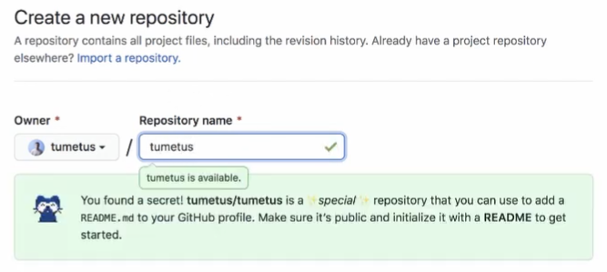
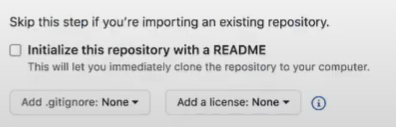

GitHub released a new feature few days ago: GitHub profile readme! You can now add a readme file to be displayed on your GitHub profile page.

_See also [If you use Git and VS Code – Read This!](/blog/if-you-use-git-and-vs-code-read-this/)_

This is a great way to tell more about yourself or for example advertise your blog or YouTube channel. The readme file supports markdown so you can do same things that you can with normal readme files in GitHub.

I uploaded a video to my YouTube channel where I show you how to add a readme file to your own GitHub profile. On the video I also go through couple of very cool and creative ways to use the readme file to boost your GitHub profile. You can watch the video below or clicking [here](https://www.youtube.com/watch?v=9sxWizm4--w).

If you rather read, here is a short summary on how to add the readme file to your profile (I still strongly recommend checking out [the video](https://www.youtube.com/watch?v=9sxWizm4--w) and I would very much appreciate if you also subscribed to [my YouTube channel](https://www.youtube.com/channel/UC34UXFLKqdW3cpk5CBu2Siw), so you stay up to date on more videos I upload).

The way it works is you need to create a new repository and name it the same as your GitHub username is. So for example my GitHub username is tumetus, so I need to create a repository with name tumetus.

When you create the repository, you see a notification that you are creating a special repository and that the README.md file of that repository will be shown in your profile.

The repository, as you might guess, has to also have a README.md file (which is the file that will be shown in your profile page). You can initialise this when you are creating your repository.

Once you have your repository created, go check you profile page and you can see that the readme file is displayed on top of your pinned repositories.

What does your GitHub profile readme file look like? Comment your GitHub profile below!
