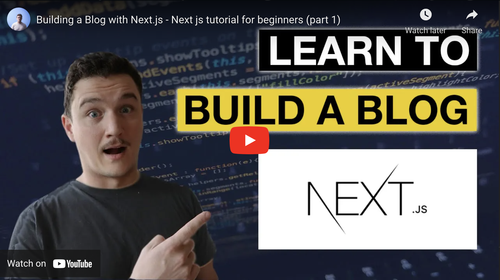

_This article was originally published on [my newsletter](/newsletter) last week. I publish previous week's newsletter here on the blog. If you want to read these as soon as they are published, [sign up](/newsletter) for the newsletter!_

Ahoy,

Couple of weeks ago [I wrote](https://tuomokankaanpaa.com/blog/best-vs-code-features-learning-material-ui) that I was working on a Next.js blog application and planning on making a video about it. I finally got the video done and I published it on the [Youtube channel](www.youtube.com/tuomokankaanpaa) last week.

[📹 View on Youtube](https://www.youtube.com/watch?v=giHGL3ZppTQ)

I ended up making it a two part video. In the first part, that is now published, I teach how to create a basic blog application with Next.js and in the process I will go through some basic concepts of Next.js, that are important to know especially for Next.js beginners.

The second part I am planning on publishing in the near future (maybe next week). That will be about integrating a headless CMS with the blog. So after that the blog will basically be ready to use in production.

Ok to be honest, it could use some styling before production, so I might also do another video about styling the blog and making it look a bit more nice. Let me know if this is something you would be interested in!

Design is really a part that I probably struggle the most. If I have a design ready and I only need to implement it, that's easy. But making the actual design is not my strong suit. So it will be fun to try to implement that to the application and I am sure that I will learn a ton while working on it.

## Top picks for this week 🎯

⚡ [14 Rules That Will Make You A Better Developer](https://medium.com/quick-code/14-important-rules-that-every-developer-should-follow-9839a574b59e)

⚡ [How to Improve as a Programmer?](https://medium.com/quick-code/15-tips-to-instantly-improve-as-a-programmer-9c9dde55471f)

⚡ [Github Universe (Oct 27-28)](https://www.githubuniverse.com/)

That's it for this week!

Cheers,
Tuomo
