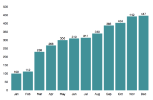

In this post we will create a bar chart component with React and use it to display an array of objects with x and y properties. We will use react-vis library to do this.

This is what our finished bar chart will look like.



React-vis is an open source library for displaying all kinds of visual representations of data. It can do very many things including complex graphs with complex datasets. When you open up the documentation, it can be a bit overwhelming and hard to find how to exactly create a basic bar chart. So we will create just a basic bar chart that will do the job and you can tweak it more if you need to.

_I am using yarn for managing packages. You can download yarn from here [https://yarnpkg.com/en/docs/install](https://yarnpkg.com/en/docs/install)_ _. If you prefer npm instead, just substitute the yarn commands with corresponding npm commands._

We will create an example project from scratch to play around with react-vis. I decided to use create-react-app for this and in the matter of fact the react-vis documentation also offers instructions how to do this ([https://uber.github.io/react-vis/documentation/getting-started/creating-a-new-react-vis-project](https://uber.github.io/react-vis/documentation/getting-started/creating-a-new-react-vis-project)). If you’d like to use your existing project, you can just skip the create-react-app part and run “_yarn add react-vis_” in your project directory.

First, if you haven’t done so already, we install create-react-app “_npm install -g create-react-app_”.

Then we create our project and install react-vis to it.

```terminal
create-react-app my-barchart-app
cd my-barchart-app
yarn add react-vis
```

Now we are ready for some charts! Let’s create a new file and name it MyBarChart.js. Then import React and add the following code to it.

```jsx
// MyBarChart.js
import React from 'react';

class MyBarChart extends React.Component {
    render() {
        const data = this.props.data;
        const chartWidth = 800;
        const chartHeight = 500;
        const chartDomain = [0, chartHeight];
        return (
           <div>barchart!</div>
        );
    }
}

export default MyBarChart;
```

Ok so we have a component that renders div with text “barchart!”. We also defined some variables in the render method. _data_\-variable will represent the dataset we want to render, it will be passed to the component as props. _chartWidth_ and _chartHeight_ will be used to set the width and height of the chart. _chartDomain_ will be used to set the yDomain-prop of the bar chart. yDomain is an array with two numbers. First number will indicate the value of the lowest point on the y-axis (bottom of the chart) and the second number will indicate the value of the highest point on the y-axis (top of the chart). We will use 0 for the first number, so that the y-axis starts from 0, and chartHeight for the second value.

Next up let’s import the MyBarChart component to our app and render it. Our App-component should look something like this.

```jsx
// App.js
import React, { Component } from 'react';
import './App.css';
import MyBarChart from './MyBarChart';
class App extends Component {
  render() {
    return (
      <div className="App">
        <MyBarChart />
      </div>
    );
  }
}
export default App;
```

Ok cool, we have our component rendering “barchart!”. Let’s actually add the bar chart now!

We are going to use XYPlot component provided by react-vis. It will act as a wrapper for all the other components we are going to use for the bar chart.

React-vis uses different Series components for displaying a chart. For bar chart we will use BarSeries components and as we want our bars to be vertical, we’ll use VerticalBarSeries component. If we wanted horizontal bars we’d use (surprise) HorizontalBarSeries.

VerticalBarSeries component will draw the rectangles (=bars). In minimum it only requires a data-prop to be passed to it. The data object should be an array containing objects for each bar.

The objects should have x- and y-keys. I created an example dataset that we will use. We will create a data.json file to our src folder and copy paste the json data shown below.

```json
[
    { "y": 100, "x": "Jan" },
    { "y": 112, "x": "Feb" },
    { "y": 230, "x": "Mar" },
    { "y": 268, "x": "Apr" },
    { "y": 300, "x": "May" },
    { "y": 310, "x": "Jun" },
    { "y": 315, "x": "Jul" },
    { "y": 340, "x": "Aug" },
    { "y": 388, "x": "Sep" },
    { "y": 404, "x": "Oct" },
    { "y": 442, "x": "Nov" },
    { "y": 447, "x": "Dec" }
]
```

Now we can import this data in our App-component and pass it to the MyBarChart-component.  After this our App-component and MyBarChart-component should look like this.

```jsx
// App.js
import React, { Component } from 'react';
import './App.css';
import MyBarChart from './MyBarChart';
import data from './data.json';

class App extends Component {
  render() {
    return (
      <div className="App">
        <MyBarChart data={data} />
      </div>
    );
  }
}

export default App;
```
```jsx
// MyBarChart.js
import React from 'react';
import {
    XYPlot,
    VerticalBarSeries
} from 'react-vis';

class MyBarChart extends React.Component {
    render() {
        const data = this.props.data;
        const chartWidth = 800;
        const chartHeight = 500;
        const chartDomain = [0, chartHeight];
        return (
            <XYPlot 
               xType="ordinal" 
               width={chartWidth} 
               height={chartHeight} 
               yDomain={chartDomain}
             >
                <VerticalBarSeries
                    data={data}
                />
            </XYPlot>
        );
    }
}

export default MyBarChart;
```

Now when you save your files and view the app on browser, you should see some nicely rendered bars.

Ok that’s cool, but we want to also show the x- and y-axis. For this react-vis provides XAxis- and YAxis-components. They are just placed inside the XYPlot component and boom we have x- and y-axis on our chart.

Our bar chart is starting to look good. One more thing we can do is to display the value of each bar on top of the bar. React-vis comes with LabelSeries component that enables us to display labels for each datapoint. In order for LabelSeries to work with our data, we need to add label-key to our data and pass it to the LabelSeries component.

By default LabelSeries will automatically calculate the position for the label based on the position of the datapoint on the chart. For example if we are near the right hand side of the chart, the label will be displayed left from the datapoint or if we are near the bottom of the chart the label will be displayed on top of the datapoint.

For our chart, we don’t want the automatic positioning but we want the label to always be on top of the datapoint and horizontally centered. To achieve this we use LabelSeries props labelAnchorX and labelAnchorY. labelAnchorX value will be “middle” and labelAnchorY value will be “text-after-edge”. More info for about other values for these props can be found from the docs [https://uber.github.io/react-vis/documentation/series-reference/label-series](https://uber.github.io/react-vis/documentation/series-reference/label-series) .

This is what our finished MyBarChart-component should look like.

```jsx
// MyBarChart.js
import React from 'react';
import {
    XYPlot,
    XAxis, // Shows the values on x axis
    YAxis, // Shows the values on y axis
    VerticalBarSeries,
    LabelSeries
} from 'react-vis';

class MyBarChart extends React.Component {
    render() {
        const data = this.props.data;
        const chartWidth = 800;
        const chartHeight = 500;
        const chartDomain = [0, chartHeight];
        return (
            <XYPlot 
                xType="ordinal" 
                width={chartWidth} 
                height={chartHeight} 
                yDomain={chartDomain}
            >
                <XAxis />
                <YAxis />
                <VerticalBarSeries
                    data={data}
                />
                <LabelSeries
                    data={data.map(obj => {
                        return { ...obj, label: obj.y.toString() }
                    })}
                    labelAnchorX="middle"
                    labelAnchorY="text-after-edge"
                />
            </XYPlot>
        );
    }
}

export default MyBarChart;
```
 
#### Conclusion

Creating charts with React and react-vis is pretty straight forward once you know your way around the react-vis components. There is a lot more you can do with react-vis and if you work with or are interested about data visualisation, for sure go ahead and check out the [documentation](https://uber.github.io/react-vis/documentation/welcome-to-react-vis) for more complex examples.

_You can find the complete source code for this tutorial from GitHub: [https://github.com/tumetus/react-vis-bar-chart](https://github.com/tumetus/react-vis-bar-chart)_

Charts are great way to visualise data. If you wish to learn more about different kind of charts, I recommend you check out [this](https://jscharting.com/blog/bar-and-column-charts/) blog post.
