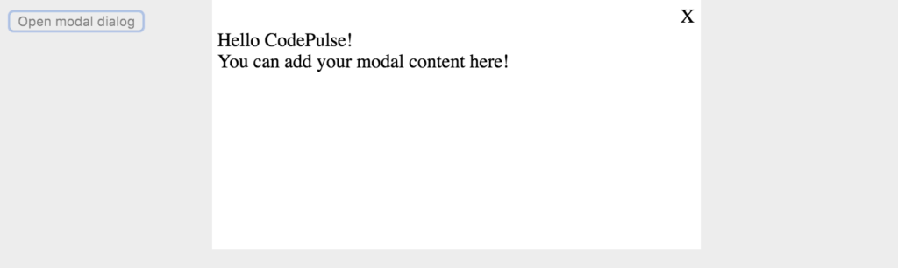

I often run into a question "How to create modal dialog with React". Modal dialogs are also something that I need to use from time to time in my own projects. So I thought that I'd share a simple re-usable Modal component with you guys and hopefully it might be of help for some of you. So let's get to it!

_Check out also my post on [6 things every beginner React developer should know](/blog/6-things-every-beginner-react-developer-should-know/)._

Creating a modal dialog with React is a bit different than the traditional Javascript way. In React you basically need two components. The actual Modal component which takes in as props the information if it should be open or closed (shown or hidden) and then a wrapper component that passes these props and takes care of managing them.

It is probably easier if you see the code for the `Modal` component first and then we go over it.

```jsx
import React from "react";
import PropTypes from "prop-types";

class Modal extends React.Component {
  render() {
    if (!this.props.isOpen) {
      return null;
    }

    const BackgroundStyle = {
      backgroundColor: "rgba(220,220,220,0.5)",
      position: "fixed",
      top: 0,
      right: 0,
      bottom: 0,
      left: 0,
    };

    const ModalStyle = {
      maxWidth: 400,
      minHeight: 200,
      backgroundColor: "#fff",
      margin: "auto",
      padding: 5,
    };

    const HeaderStyle = {
      height: 20,
      width: "100%",
    };

    const CloseBtnStyle = {
      float: "right",
      cursor: "pointer",
      display: "block",
    };

    return (
      <div style={BackgroundStyle}>
        <div style={ModalStyle}>
          <div style={HeaderStyle}>
            <span style={CloseBtnStyle} onClick={this.props.onClose}>
              X
            </span>
          </div>
          {this.props.children}
        </div>
      </div>
    );
  }
}

Modal.propTypes = {
  onClose: PropTypes.function,
  isOpen: PropTypes.bool,
  children: PropTypes.node,
};

export default Modal;
```

The `Modal` component really only needs the render-method. The most important part happens right at the beginning of the `render` method.

```jsx
if (!this.props.isOpen) {
  return null;
}
```

We check if the `isOpen` prop is `true` or `false` and based on that we decide if we continue rendering the `Modal` component. If it is `false` we just return `null` and no modal is rendered.

The `render` method also have some styling definitions that give the component the transparent gray background which covers everything under the modal and makes sure that only things on the modal can be clicked. The modal window has white background and is aligned in the middle of the screen. You can modify these style definitions to fit your preferences.

## Wrapping our Modal component

I mentioned earlier that we need two components. We now have the `Modal` component but we still need a component we can wrap around it, a component that has the information if the modal should be open or closed. We will call it the `App` component in this example. Here is the code for our `App` component.

```jsx
import React from "react";
import Modal from "./Modal";

class App extends React.Component {
  constructor(props) {
    super(props);

    this.toggleModal = this.toggleModal.bind(this);

    this.state = {
      isModalOpen: false,
    };
  }

  toggleModal() {
    const { isModalOpen } = this.state;
    this.setState({ isModalOpen: !isModalOpen });
  }

  render() {
    return (
      <div>
        <button onClick={this.toggleModal}>Open modal dialog</button>
        <Modal isOpen={this.state.isModalOpen} onClose={this.toggleModal}>
          <div>Hello CodePulse!</div>
          <div>You can add your modal content here!</div>
        </Modal>
      </div>
    );
  }
}

export default App;
```

The `App` component has `isModalOpen` stored in its state. This is used (as you might guess) to determine if the modal is open or closed.

Another part we need to have is `toggleModal` method. It reverses the current value of `isModalOpen`. So if `isModalOpen` is `false`, `toggleModal` method will set it to `true` and vice versa. This causes the `App` component to re-render and as a result the `Modal` component will re-render also.

Lastly in the `render` method we render the `Modal` component and pass in `isModalOpen` as `isOpen` prop and the `toggleModal` method as `onClose` prop. This way when in the `Modal` component the `onClose` is called, it actually calls the `App` component's `toggleModal` method which will set the `isModalOpen` to `false` and cause a re-render which then hides the modal.

This is what the open modal dialog will look like

## TL;DR

I created a [codesandbox](/blog/online-code-editor-every-web-developer-should-know-about/) so you can see the whole code for this example. The codesandbox can be found [here](https://codesandbox.io/embed/w72z3p63ql).

## Conclusion

That is how you can create your own modal component. If you don't want to create a modal component by yourself, you might want to check out some of the ready made modal components out there e.g. [react-modal](https://github.com/reactjs/react-modal).

I would like to hear from you so if you have any comments, please drop them below!

Remember also to subscribe to CodePulse newsletter, if you haven't already, to stay tuned on the latest news and posts about modern web development. Newsletters go out usually max once a month and you can unsubscribe anytime you want.
