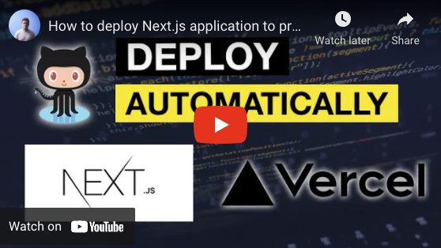

_This article was originally published on [my newsletter](/newsletter) last week. I publish previous week's newsletter here on the blog. If you want to read these as soon as they are published, [sign up](/newsletter) for the newsletter!_

Ahoy,

This week was pretty Jamstack focused for me. This was because of two reasons.

## Jamstack conf

The [Jamstack conf](https://jamstackconf.com/) was held 6.10-7.10 as a virtual conference. The first day was full of talks and the second day was dedicated to workshops. I wasn't able to participate on the workshops but I got a good dose of Jamstack watching the first day talks.

If you missed the conference, no worries! You can find the videos of the talks from this playlist: [https://www.youtube.com/playlist?list=PL58Wk5g77lF-XaNacKxWk7yOKgeCMveAS](https://www.youtube.com/playlist?list=PL58Wk5g77lF-XaNacKxWk7yOKgeCMveAS).

## How to deploy Next.js app to production

This week's video on the [Youtube channel](https://www.youtube.com/tuomokankaanpaa) was also about Jamstack, well Next.js to be more specific.

In the video I show you how to deploy your Next.js application to production (using Vercel) and setup the deploy in a way that it automatically deploys your app when ever there is updated code in your Github main branch.

Setting it up is one of the easiest setups I know, because Vercel does all the heavy lifting and all you pretty much have to do is point Vercel to your Github repo and you are good to go.

[📹 View on Youtube](https://www.youtube.com/watch?v=vFjlw3LaAcw)

## Non-coding stuff

While not working on coding stuff, I did some reading and actually read one whole book this week (rocking the Kindle!). The book I read was [Take Your Shot](https://amzn.to/3DBBDQD) by Robin Waite.

I liked the book a lot because it teaches business skills but in an interesting and captivating way. The book uses storytelling as a way of teaching which in my opinion is a great. You are entertained by the story but at the same time you learn a bunch. One other book that uses this kind of approach marvellously is [The Wealthy Barber](https://amzn.to/302w7aZ).

I warmly recommend reading Take your shot and Wealthy Barber if you haven't already!

That's it for this week!

Cheers,
Tuomo
