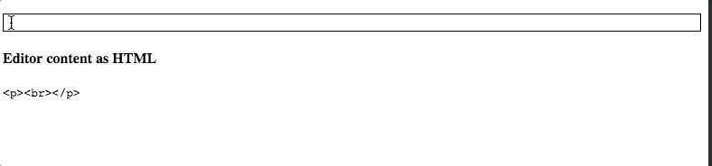

_This post was originally published 1.4.2018._

[Draft.js](https://draftjs.org/) is a great way to implement rich text editors with React. It can be little unclear though what you should do when you want to display your editor content as plain HTML. In this post we will learn how to do just that, by converting our editor state to HTML that can be displayed without Draft.js editor.

_I just published a class where I teach more about Draft.js. Best part is that you can get it for free! [Read more](/blog/rich-text-editing-in-react-with-draft-js-course/)._

## Displaying ContentState as HTML

[Draft.js docs](https://draftjs.org/docs/api-reference-data-conversion) state the following: “_Note that the Draft library does not currently provide utilities to convert to and from markdown or markup, since different clients may have different requirements for these formats. We instead provide JavaScript objects that can be converted to other formats as needed._”.

What this means is that Draft.js does not provide utilities for converting the editor content to HTML. Instead we need to use a different library for that. There is a bunch of options to choose from. I like to use [draft-js-export-html](https://www.npmjs.com/package/draft-js-export-html).

draft-js-export-html provides `stateToHTML` method that generates HTML representation for given `ContentState` object. Using it is quite straight forward. Let’s look at an example.

## Example

In the example below, we have plain Draft editor and we display its contents as HTML below the editor. The conversion from `ContentState` to HTML is done in the `onChange` handler in line 12 (if you are not familiar with `getCurrentContent()` function, it returns `ContentState` object from an `EditorState` object).

```jsx
import React from "react";
import { Editor, EditorState } from "draft-js";
import { stateToHTML } from "draft-js-export-html";

class ExampleEditor extends React.Component {
  constructor(props) {
    super(props);
    this.state = { editorState: EditorState.createEmpty() };
    this.onChange = (editorState) => {
      this.setState({
        editorState,
        editorContentHtml: stateToHTML(editorState.getCurrentContent()),
      });
    };
  }

  render() {
    return (
      <div>
        <div className="editor-container" style={{ border: "1px solid #000" }}>
          <Editor
            editorState={this.state.editorState}
            onChange={this.onChange}
          />
        </div>
        <h4>Editor content as HTML</h4>
        <pre>{this.state.editorContentHtml}</pre>
      </div>
    );
  }
}

export default ExampleEditor;
```

So first we import `stateToHTML` from draft-js-export-html. Then in the line 12 in the `onChange` handler we generate the HTML version of the ContentState and save it to the component's state. We display the generated HTML in the render method on line 27. Since the generating of the HTML is done in the `onChange` handler, we can see the updated HTML as we make changes to the editor.



## Conclusion

We used `stateToHTML` function from draft-js-export-html library to generate HTML out of a `ContentState` object. This was a clean and easy way to convert the contents of the editor to HTML.

I created a [codesandbox](/blog/online-code-editor-every-web-developer-should-know-about/) for the example above so you can test it out by yourself. I added also another example with an editor that has some rich text editing features to the codesandbox. You can find the codesandbox [here](https://codesandbox.io/s/rw90r46934).

HTML works well for displaying purposes but if you want to store your editor content for a later use, HTML is not the ideal way to do it. For that you should read a post I wrote on [How to store Draft.js content](/blog/how-to-store-draft-js-content/). Also don't forget to sign up for a CodePulse newsletter below to stay up to date on the latest posts and other cool stuff we have to offer! And of course, if you have any questions or comments I would be happy to hear them so go ahead and drop a comment below!
