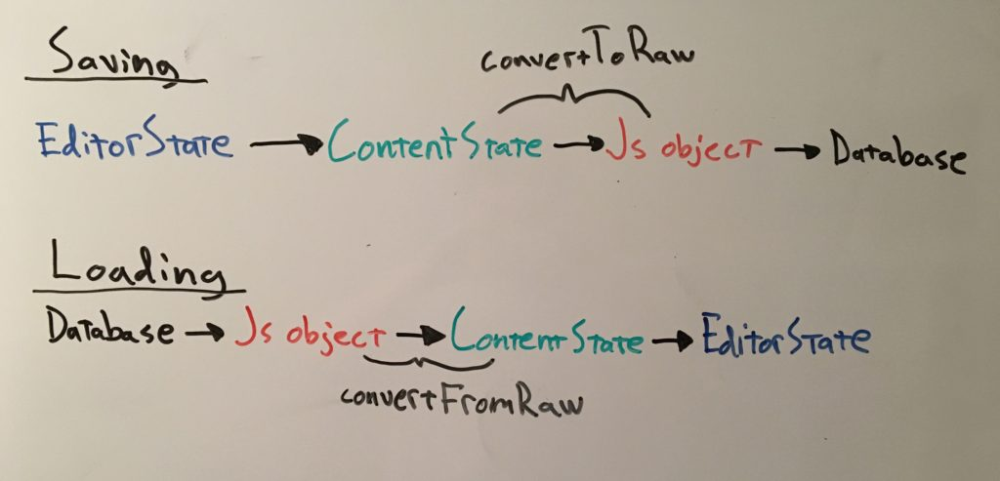

[Earlier I wrote](/blog/how-to-display-draft-js-content-as-html/) about Draft.js and how to display editor content as HTML. Most often just showing the current editor content as HTML is not sufficient and we need to store the editor content somewhere for example to a database. The HTML representation of the editor content can of course be stored to a database, but that is not the best option.

_I just published a class where I teach more about Draft.js. Best part is that you can get it for free! [Read more](/blog/rich-text-editing-in-react-with-draft-js-course/)._

Draft.js comes with _convertToRaw_ method that takes in a ContentState object and returns the given ContentState as a raw javascript object. This object can then be stored to a database or wherever you need to store your application’s data.

Then when we need to load the data from the database, we get the raw javascript object and we make use of another method provided by Draft.js, _convertFromRaw_. This method takes in a raw javascript object and returns corresponding ContentState object. You can then use this ContentState object to populate your Draft.js editor with your content.



Let’s see an example:

```jsx
import React from "react";
import {
  Editor,
  EditorState,
  RichUtils,
  convertToRaw,
  convertFromRaw,
} from "draft-js";

class DraftEditorRawExample extends React.Component {
  constructor(props) {
    super(props);
    this.state = { editorState: EditorState.createEmpty() };
    this.onChange = (editorState) => {
      // Convert to raw js object
      const raw = convertToRaw(editorState.getCurrentContent());
      // Save raw js object to local storage
      this.saveEditorContent(raw);

      this.setState({ editorState });
    };
  }

  componentDidMount() {
    // Load editor data (raw js object) from local storage
    const rawEditorData = this.getSavedEditorData();
    if (rawEditorData !== null) {
      const contentState = convertFromRaw(rawEditorData);
      this.setState({
        editorState: EditorState.createWithContent(contentState),
      });
    }
  }

  saveEditorContent(data) {
    localStorage.setItem("editorData", JSON.stringify(data));
  }

  getSavedEditorData() {
    const savedData = localStorage.getItem("editorData");

    return savedData ? JSON.parse(savedData) : null;
  }

  handleKeyCommand(command) {
    const { editorState } = this.state;
    const newState = RichUtils.handleKeyCommand(editorState, command);
    if (newState) {
      this.onChange(newState);
      return true;
    }
    return false;
  }

  renderContentAsRawJs() {
    const contentState = this.state.editorState.getCurrentContent();
    const raw = convertToRaw(contentState);

    return JSON.stringify(raw, null, 2);
  }

  render() {
    return (
      <div>
        <h4>Draft js editor</h4>
        <div className="editor-container">
          <Editor
            handleKeyCommand={this.handleKeyCommand.bind(this)}
            editorState={this.state.editorState}
            onChange={this.onChange}
          />
        </div>
        <h4>Editor content as raw JS</h4>
        <pre>{this.renderContentAsRawJs()}</pre>
      </div>
    );
  }
}

export default DraftEditorRawExample;
```

_Here is a working demo: [https://github.com/tumetus/draft-js-to-raw](https://github.com/tumetus/draft-js-to-raw)_

In the example the component has a Draft.js editor and a pre-element that displays the editor content as raw javascript. It also saves the editor’s content to local storage so that when you refresh the page, the editor is populated with the saved data.

Saving and loading makes use of the _convertToRaw_ and _convertFromRaw_ methods mentioned earlier. So in this example you could also save the data for example to a server, instead of just saving it to local storage. For convenience reasons I made this example to save the data to local storage.

So as we see saving and loading Draft.js editor content is pretty straight forward in the end. If you have any questions or comments feel free to leave your comment below.
