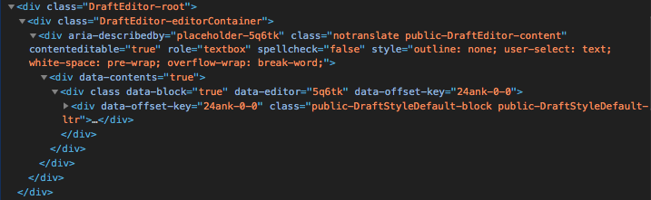
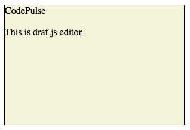

In this post we will take a look how you can style your Draft.js editor component. We will make the editor multiline, scrollable and add background and border styles. Draft.js itself does not provide any default styling for the editor and thus the styling of the editor has been left completely for the user. However it might be a bit unclear how to style Draft.js editor so that is what we will learn in this post.

_You can learn more about Draft.js in my online course, which you can get for free (limited time offer)! [Read more](/blog/rich-text-editing-in-react-with-draft-js-course/)._

## Style Draft.js editor

Let's first create a very basic editor component. I am going to use the one shown in [Draft.js docs](https://draftjs.org/docs/getting-started.html#usage).

```jsx
class MyEditor extends React.Component {
  constructor(props) {
    super(props);
    this.state = { editorState: EditorState.createEmpty() };
    this.onChange = (editorState) => this.setState({ editorState });
  }
  render() {
    return (
      <Editor editorState={this.state.editorState} onChange={this.onChange} />
    );
  }
}
```

Now if we render this component we can see that it is basically a text input without any borders (we can't really see it) and it has just one line. This is rarely what we want. So let's inspect it with dev-tools in order to get a better picture how we can style it.



From the dev-tools we can see that there is three divs that have the following classes: DraftEditor-root, DraftEditor-editorContainer and public-DraftEditor-content. We can target these three classes with our CSS in order to style the editor.

So let's say we want our editor to have the height of 200px and width of 300px. We also want it to have black border and beige background. This is what it would look like.



We need to add the `border`, `background-color`, `height` and `width` properties to the `DraftEditor-root` element. We should also add `overflow-y: auto` for it so the editor is scrollable. But if we do just this, the writeable are is still the height of one row. So what we still need to do is add `height: 100%` to the elements with class `DraftEditor-editorContainer` and `public-DraftEditor-content`. We can add these styles to styles.css file which would look like this.

```css
div.DraftEditor-root {
  border: 1px solid #000;
  background-color: beige;

  height: 200px;
  width: 300px;
  overflow-y: auto;
}

div.DraftEditor-editorContainer,
div.public-DraftEditor-content {
  height: 100%;
}
```

Finally let's import the styles.css so the styles are applied.

```jsx
`import './styles.css';`;
```

[Here](https://3kgxs.codesandbox.io/) is a codesandbox for the complete component. Below is a [video](http://www.youtube.com/watch?v=u3R5M1mqF-s) of me doing this example.

[](http://www.youtube.com/watch?v=u3R5M1mqF-s)

## Conclusion

Styling Draft.js editor doesn't differ from styling any other html elements. The trick is that you need to understand what Draft.js editor component renders to the DOM and then target the rendered elements correctly. As we saw the basic styling can be pretty much done by targeting the three elements that are rendered to the DOM by the editor component.

## TL;DR

[Here](https://3kgxs.codesandbox.io/) is a codesandbox for this example. Style the editor by targeting these three classes:  `DraftEditor-root`, `DraftEditor-editorContainer` and `public-DraftEditor-content`.
