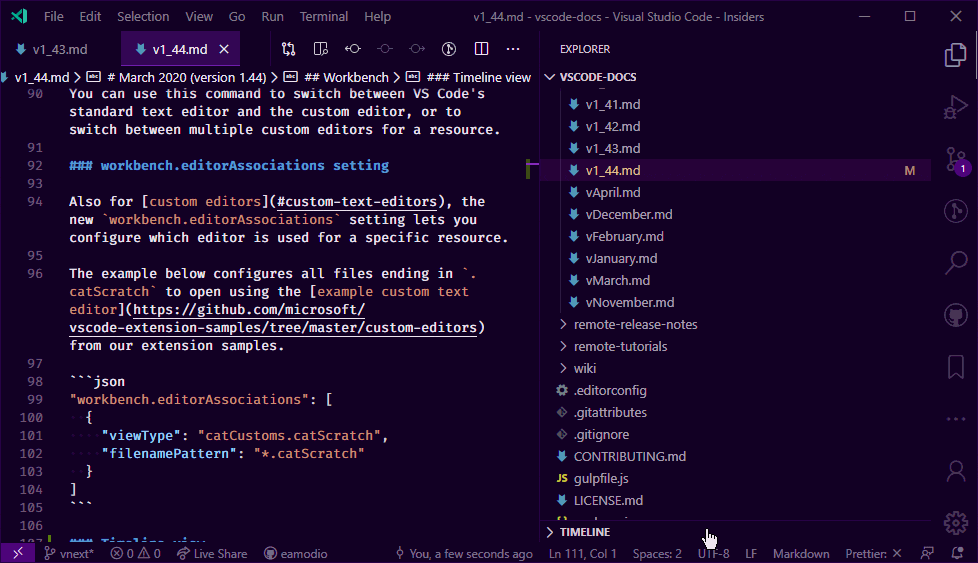

I am, like many other developers nowadays, using Git and VS Code as my version control and code editor. Couple of weeks ago I wrote about the [Best extensions for VS Code in 2020](/blog/best-extensions-for-vs-code-in-2020/).

In that post I mentioned GitLens as one of my favourite plugins. This was mostly because I use Git and I need to see Git commit history and changes for a given file and VS Code itself doesn't offer a good tool for that. Well not until March 2020 update.

## Introducing Timeline

In the [March 2020 update](https://code.visualstudio.com/updates/v1_44#_timeline-view) _Timeline view_ was out of preview and enabled by default. Timeline view is a unified view for visualising time-series events (for example, Git commits, file saves, test runs, etc.) for a file.

So basically you can select different sources for the timeline and if you for example select Git as a source, you get nice view of Git commit history for a file. You can also view the commits and see a diff view for the file.

Here is a quote from the release notes: _In this release, the built-in Git extension contributes a timeline source that provides the Git commit history of the specified file. Selecting a commit will open a diff view of the changes introduced by that commit. A context menu provides commands to **Copy Commit ID** and **Copy Commit Message**. There is also a new **Open Timeline** command on the File Explorer's context menu, to quickly show the timeline for the selected file._

I have been using the timeline view quite a lot for the past few weeks and personally I think it's a great and very needed addition to VS Code. What do you think?
