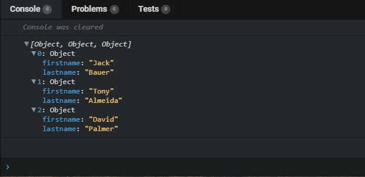
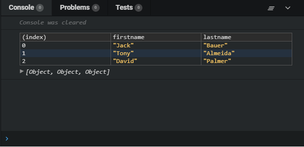

When working with Javascript applications chances are you sometimes use console.log() when debugging your application. It is fast way to view data in the console and get an idea how your application is working. Most often the data is some kind of an object or array. When logging these to console you don't always see all the data and have to click the object open quite a bit and you end up something like this:

This is a bit nasty since you have to click open the object to see what's inside. A better way to log your objects and arrays is to use **console.table()**.

console.table() takes an object or array as parameter and prints a very nice table of the data. This is what the previous example looks like with console.table():

Hope this helps you at least a bit with your debugging efforts!

So whip out your dev tools and give it a try yourself or play with it in [codesandbox](https://codepulse.blog/2018/06/27/online-code-editor-every-web-developer-should-know-about/) by clicking below!

  

If you have questions or something to add, feel free leave a comment below!
