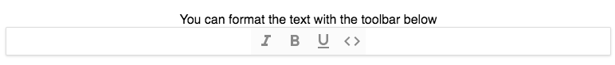

When you start to use Draft.js you quickly realize that it doesn't come with a lot of ready to use features or utilities. Yes, you can build e.g. a toolbar with rich text editing features but there is not one ready for you to use in Draft.js.

_If you are not yet familiar with Draft.js be sure to read my post on [Getting started with Draft.js](/blog/getting-started-with-draft-js/)._

It is possible for you to create all kind of cool features to your editor such as static toolbar, Slack-like emojis, Facebook-like stickers & mentions. But it requires a lot of work and you need to know a lot of how Draft.js works. Thankfully there is draft-js-plugins that does all the heavy lifting for you.

## draft-js-plugins

This is what is said in the [draft-js-plugins homepage](https://www.draft-js-plugins.com/):

_Facebook's rich-text editor framework DraftJS built on top of React allows you to create powerful editors. We're building a plugin architecture on top of it that aims to provide you with plug & play extensions. It comes with a set of plugins with great UX serving mobile & desktop as well as screen-readers. You can combine them in any way you want or build your own._

So with draft-js-plugins you get a set of plugins that work out of the box and they can be implemented to a Draft editor. Here is a list of the plugins that are currently being offered:

- Mention
- Emoji
- Image
- Video
- Sticker
- Hashtag
- Inline toolbar
- Side Toolbar
- Static Toolbar
- Undo
- Counter
- Anchor
- Linkify
- Focus
- Alignment
- Resizeable
- Drag'n'Drop
- Divider

## Setup for adding plugins

Usage of the plugins is pretty simple but depending on the plugin they may need some configuration. Let's see how we can take a Static toolbar plugin and add it to a Draft editor.

_Here is a link to a [codesandbox](/blog/online-code-editor-every-web-developer-should-know-about/) with the finished component: [https://codesandbox.io/s/km4436q4lv](https://codesandbox.io/s/km4436q4lv)_

Here is code for simple Draft editor before we add the plugin.

```jsx
import React, { Component } from "react";
import { Editor, EditorState } from "draft-js";

export default class SimpleStaticToolbarEditor extends Component {
  state = {
    editorState: EditorState.createEmpty(),
  };

  onChange = (editorState) => {
    this.setState({
      editorState,
    });
  };

  render() {
    return (
      <div>
        <div>
          <Editor
            editorState={this.state.editorState}
            onChange={this.onChange}
          />
        </div>
      </div>
    );
  }
}
```

First we need to install the draft-js-plugins-editor by running the following:

```
yarn add draft-js-plugins-editor
```

Then we import editor component from draft-js-plugins-editor and replace the Draft.js editor component with it. The draft-js-plugins-editor's editor component is basically just a wrapper component for the Draft.js editor component. It adds "plugins" prop for the editor which will be used to pass plugins for the editor. Our component should look like this now:

```jsx
import React, { Component } from "react";
import { EditorState } from "draft-js";
import Editor from "draft-js-plugins-editor";

export default class SimpleStaticToolbarEditor extends Component {
  state = {
    editorState: EditorState.createEmpty(),
  };

  onChange = (editorState) => {
    this.setState({
      editorState,
    });
  };

  render() {
    return (
      <div>
        <div>
          <Editor
            editorState={this.state.editorState}
            onChange={this.onChange}
          />
        </div>
      </div>
    );
  }
}
```

Now we are ready to add plugins for the editor. Next we will add the Static Toolbar plugin to our editor.

## Static toolbar plugin

Install the plugin by running the following:

```
yarn add draft-js-static-toolbar-plugin
```

After we have installed the plugin we import it and create a plugin out of it. Then we import the Toolbar component itself from the created plugin. I add the code for our **completed** component here next and explain what we did.

```jsx
import React, { Component } from "react";
import Editor, { createEditorStateWithText } from "draft-js-plugins-editor";
import createToolbarPlugin from "draft-js-static-toolbar-plugin";
import editorStyles from "./editorStyles.css";
import "../node_modules/draft-js-static-toolbar-plugin/lib/plugin.css";

const staticToolbarPlugin = createToolbarPlugin();
const { Toolbar } = staticToolbarPlugin;
const text = "You can format the text with the toolbar below";

export default class SimpleStaticToolbarEditor extends Component {
  state = {
    editorState: createEditorStateWithText(text),
  };

  onChange = (editorState) => {
    this.setState({
      editorState,
    });
  };

  render() {
    return (
      <div>
        <div className={editorStyles.editor}>
          <Editor
            editorState={this.state.editorState}
            onChange={this.onChange}
            plugins={[
              staticToolbarPluginstaticToolbarPluginstaticToolbarPluginstaticToolbarPluginstaticToolbarPluginstaticToolbarPluginstaticToolbarPluginstaticToolbarPlugin,
            ]}
          />
          <Toolbar />
        </div>
      </div>
    );
  }
}
```

So first we import the draft-js-static-toolbar-plugin on line 3. We also import some default styling on line 5 so our toolbar looks good. Feel free to customize the styling by yourself. Then we create the plugin out of it and import the `Toolbar` component from it on lines 7-9. We initialise the editor state with text with the help of `createEditorStateWithText()` function that comes with draft-js-plugins-editor. This is not necessary and we could as well initialise it with `EditorState.createEmpty()` if we'd like an empty editor. Lastly we pass the plugin for the `Editor` component inside the render method and render the `Toolbar` component. Note that when passing plugin(s) for the editor the variable must be an array since we can pass multiple plugins for the same editor.

This is what the editor should look like:



This editor is with default settings and as said it can be further customised. You can see more about configuring the plugin from the [static toolbar plugin docs](https://www.draft-js-plugins.com/plugin/static-toolbar).

## Conclusion

draft-js-plugins offers a bunch of great and often used features that can be added to your web application with ease. We saw how to add a single plugin to a Draft editor and we just scratched the surface with it since we could add also stuff like emojis, stickers and mentions to our application if we wished.

This was an introduction to draft-js-plugins and I will be writing more posts on different plugins and how you can use them. For now you can check out the [documentation](https://www.draft-js-plugins.com/) for more info on different plugins and they also provide good instructions on how to use them.

As always I would be happy to hear from you! So if you have any questions or comments don't hesitate to drop a comment below! Also be sure to subscribe to CodePulse newsletter to stay tuned on the latest news and posts about modern web development. Newsletters go out usually max once a month and you can unsubscribe anytime you want.
