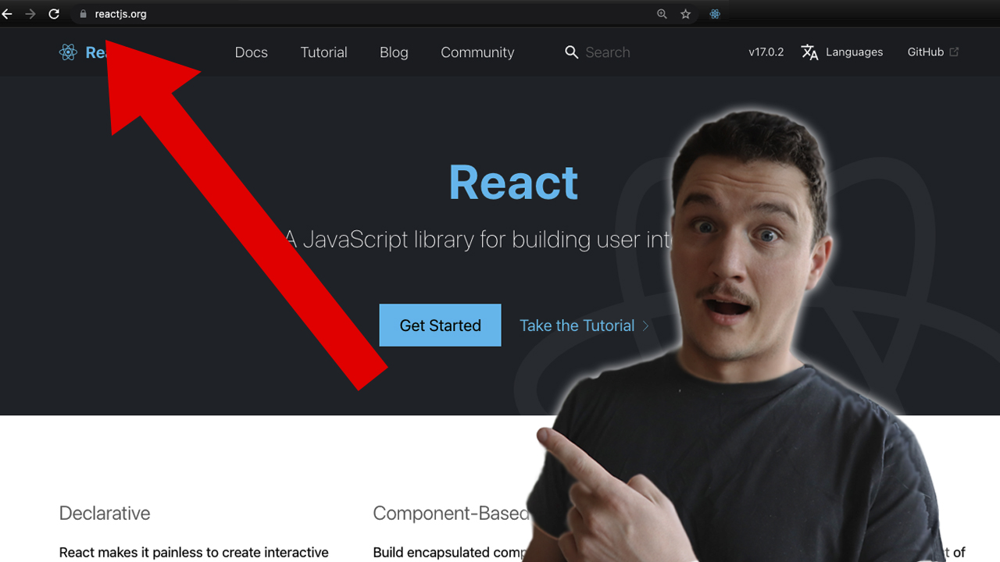

_This article was originally published on [my newsletter](/newsletter) last week. I publish previous week's newsletter here on the blog. If you want to read these as soon as they are published, [sign up](/newsletter) for the newsletter!_

Ahoy,

Are you using React? If your answer is YES then you need to keep reading!

When using React, browsing the React docs is something that at least I do frequently. So I was super excited when I learned that the React team is rewriting the documentation and we can actually already access the new docs!

The new React.js docs are still in beta and a work in progress but by going to [beta.reactjs.org](https://beta.reactjs.org) you can already take them for a spin!

## So what's new in the docs?

One of the things that I really like in the new docs is the fact that all the explanations are written using Hooks and functional components rather than classes and class based components.

For me I'm nowadays always using hooks + functional components and the only time I use class based components is when I'm working with an older codebase and modify existing components.

I uploaded a video this week talking about all my thoughts on the new docs and I also go more in depth on what's new in them. You can watch the video on the [Youtube channel](https://www.youtube.com/tuomokankaanpaa).

[📹 View on Youtube](https://www.youtube.com/watch?v=LyrZEho45yw)

That's all for this week!

Cheers,
Tuomo
