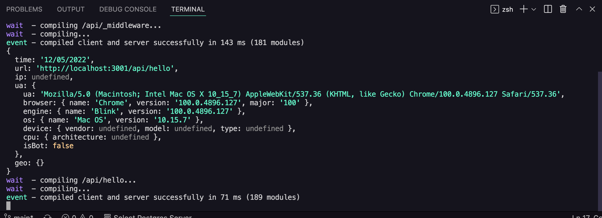
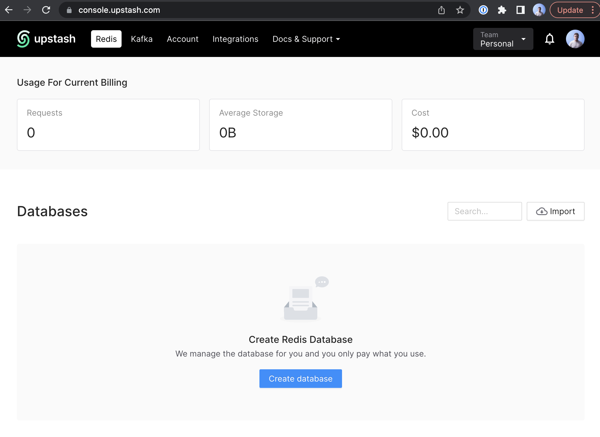
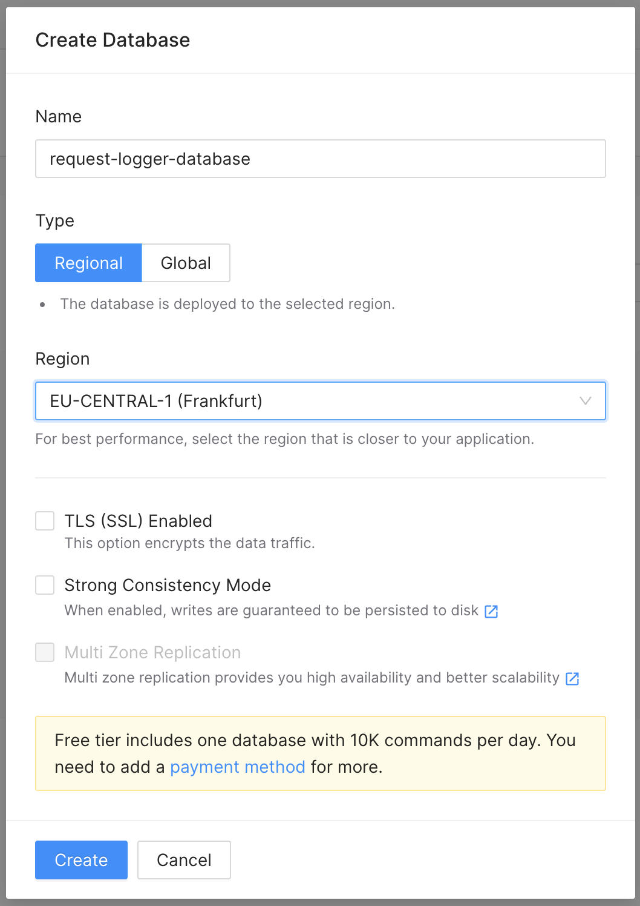
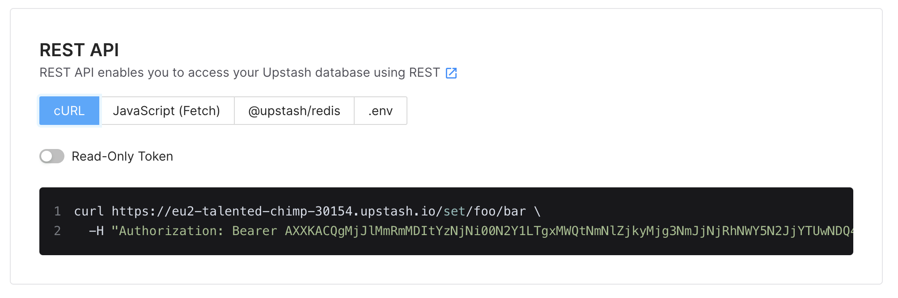
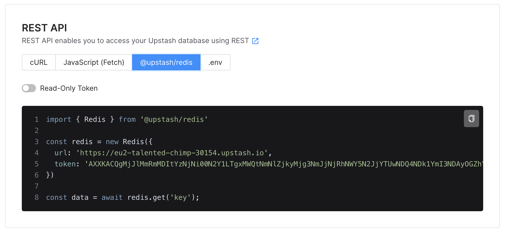

In this article we will learn how to save and fetch data from Redis inside of a Next.js middleware & edge functions. We will do this by building a request logger middleware for a fresh Next.js application. You can add this middleware also to your existing application. The middleware will save request data to Redis for each request made to the api routes. We will use [Upstash](https://www.upstash.com) Redis for handling setting up and maintaining the Redis database. Let's get started!

If you rather watch a video, I also made a video about this on my [Youtube channel](https://www.youtube.com/tuomokankaanpaa)!
[

](https://www.youtube.com/watch?v=hY2BGM7AnmY)

## Create the middleware

First initialise a new Next.js project.

```
yarn create next-app nextjs-request-logger
```

Navigate to the `/pages/api` folder and create a new file called `_middleware.js`.

```
touch pages/api/_middleware.js
```

It is important that you name the file exactly as described above because this is how Next.js knows that this file will act as a middleware. Code inside middleware will be run on each request that is made to any route inside this folder (/api) or any of its subfolders / subroutes.

Next add the following code to the `_middleware.js`

```jsx
import { NextResponse } from "next/server";

export default async function middleware(request) {
  const response = NextResponse.next();

  const time = Date.now();
  const timeStr = new Date(time).toLocaleDateString();

  const logData = {
    time: timeStr,
    url: request.url,
    ip: request.ip,
    ua: request.ua,
    geo: request.geo,
  };

  console.log(logData);

  return response;
}
```

This will get information from the request and format it to the `logData` object and for now, just log it to the console. To test it, start your server with `yarn dev`, open `localhost:3000/api/hello` in the browser and check out your terminal, you should see the request information logged to the terminal.



Now our middleware is getting information from the request and storing it to the `logData` object. Only thing left to do is to save that `logData` object to Redis!

## Save data to Redis

We will use Upstash Redis for handling the Redis database. Upstash offers a REST api for interacting with the Redis database. This is great because we need to interact with the Redis database inside our middleware. Middleware is run as edge function once we deploy it and having to use some Redis client connection inside the edge function would be prone to bugs compared to just making a REST api request once we want to save data to the database.

First create a new folder called `lib` to the root of your project and `redis.js` file inside that folder.

Next navigate to [console.upstash.com](https://console.upstash.com/) and sign up or log in to your Upstash account. Once you are logged in, go to the Redis tab and create a new database.





Once you have created the database, go to the Details tab of your database and you should see "REST API" section.



In the section click "@upstash/redis" tab and you should see a Javascript code snippet.



This code snippet uses `@upstash/redis` npm package to initialise a Redis REST client that interacts with the REST api. Copy the code and paste it in to your `lib/redis.js` file and add an export statement to the end of the file. Your `lib/redis.js` file should look like this (excluding the values of url and token).

```jsx
import { Redis } from "@upstash/redis";

const redis = new Redis({
  url: "https://eu2-talented-chimp-30122.upstash.io",
  token:
    "UJKJACQgMjJlMmRmMDItYzNjNi11N2Y1LTgxMWQtNmNlZjkyMjg3NmJjNjRhNWY5N2JjYTUwNDQ4NDk1YmI3NDAyOGZhYzQwMzY=",
});

export { redis };
```

Next import the Redis REST client we just made, to the `_middleware.js` file.

```jsx
// ...
import { redis } from "../../lib/redis";
// ...
```

To save our `logData` to Redis using the Redis REST client, add the following code after the `logData` definition.

```jsx
// ...
redis.lpush("api-request-log", logData);
// ...
```

This will push the `logData` object to a list called "api-request-log" using the REST api of Upstash Redis. Your `_middleware.js` should look the following.

```jsx
import { NextResponse } from "next/server";
import { redis } from "../../lib/redis";

export default async function middleware(request) {
  const response = NextResponse.next();

  const time = Date.now();
  const timeStr = new Date(time).toLocaleDateString();

  const logData = {
    time: timeStr,
    url: request.url,
    ip: request.ip,
    ua: request.ua,
    geo: request.geo,
  };

  redis.lpush("api-request-log", logData);

  return response;
}
```

Now we have a middleware that saves data to Upstash Redis.

## Fetch data from Redis

We are now saving every request made to `/api*` to Redis database but how can we get the saved data from the database and display it?

Let's first create a new page that will be used for displaying the json data from the Redis database. Create a new page `pages/view-log.js` and add the following code to it.

```jsx
import { redis } from "../lib/redis";

export default function ViewLog(props) {
  return (
    <div>
      <h1>Api request log</h1>
      {props.entries.map((entry) => {
        return (
          <div>
            <pre>{JSON.stringify(entry, null, 2)}</pre>
          </div>
        );
      })}
    </div>
  );
}

export async function getServerSideProps(context) {
  const entries = await redis.lrange("api-request-log", 0, -1);
  return {
    props: { entries },
  };
}
```

On the first line we import the Redis REST client we made in the previous step. Earlier we used it to save data through the REST api but it can also be used for fetching data from the database.

Then we have the `ViewLog` component which will loop through `props.entries` and display them. The `props.entries` are set in the `getServerSideProps` function.

In the `getServerSideProps` function we use `redis.lrange("api-request-log", 0, -1)` to load the data from the Upstash Redis database. First parameter is the list name we want to fetch, second parameter is the starting position and third parameter is the end position. By using -1 for the end position we tell the function that we want to fetch all of the items in the list.

Now when you navigate to `localhost:3000/view-log` you should see all the log requests that are saved to Upstash Redis.

## Conclusion

Building this kind of request logger middleware with Next.js middleware doesn't actually require that much effort. When we place the logger code to the `api/_middleware.js` we automatically have logging for all api route requests thanks to how Next.js middleware works.

Using Redis inside Next.js middleware and edge functions was also easier than I first thought. Thanks to Upstash we were able to easily spin up a Redis database and connect to it via REST api. Saving and loading data to & from the database was easy and straightforward.

You can find the repo for this article here: [https://github.com/tumetus/nextjs-request-logger](https://github.com/tumetus/nextjs-request-logger).

If you enjoyed this article be sure to subscribe to my [newsletter](https://www.tuomokankaanpaa.com/newsletter) and [Youtube channel](https://www.youtube.com/tuomokankaanpaa)!
