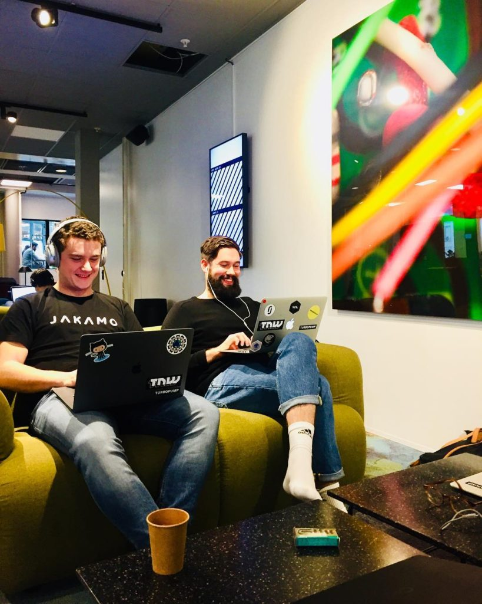

Most of the time coding requires undivided concentration on the task at hand. So do you know the feeling when you are working on something that requires your full attention. Then something happens around you, phone rings or people start a conversation, and this breaks your concentration.

That used to happen to me a lot. That is before I discovered noise cancelling headphones.

Before my discovery I had always used some normal headphones. Whenever I bought new pair, I would try to find one that cancels the outside noise by being tightly set around my ears. And of course the sound needed to be good too and they needed to fit my head well so that they could be worn several hours.

Then I learned that there is this thing called noise cancelling headphones. I know (now), they have been around quite some time but this was new to me.

I went to a store and tried out a pair of [Bose's QuietComfort 35 (Series I)](https://amzn.to/2OhFAjG). I was sold instantaneously. I was thinking "I need these!". Only thing slowing me from rushing to the cashiers with the headphones was the 400€ price tag. That was a lot more than I was used to pay for a pair of headphones. But because the sound was good, they fit well to my head and most importantly they literally canceled out every other noise from the store, I was convinced that they would be a good investment.

I am happy to say that they were!

#### Life ANCH (After Noise Cancelling Headphones)

I do most of my programming in an open office or places that are crowded and tend to have quite a bit background noise or people having conversations. With my old headphones I could always hear some of the background noise or a conversation that other people were having near me. With my Boses, once I place them on my ears and put on the music, every other sound disappears and I am able to concentrate on my coding without being disturbed by my surroundings.

I have used my noise cancelling headphones for two years soon. Has it been worth the money? Definitely.

I am able to concentrate on my work better and much easily and I have experienced improvements in productivity since I'm being distracted less by my surroundings. One thing is for sure, I won't be buying any other than noise cancelling headphones in the future either.

\[caption id="attachment\_344" align="aligncenter" width="640"\] My headphones in action\[/caption\]

#### Conclusion

If you are working in open office or crowded place I strongly recommend getting a pair of noise cancelling headphones for yourself if you have a chance. At least go to a store and try them out so you see how well they can work.

I have only used the [Bose QuietComfort 35 (Series I)](https://amzn.to/2OhFAjG) model but I'm sure there are many other good ones too. Just keep in mind that some very cheap models might not work as well as some more expensive ones. If you choose to go with Bose you might want to check out the [Series II of the QuietComfort 35](https://amzn.to/2LVdxJW). It is a newer version of the ones that I have.

That's it folks! If you have something to add, please be sure to leave a comment below! I would be happy to hear from you!
