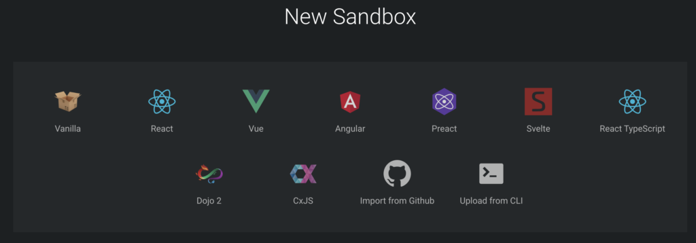
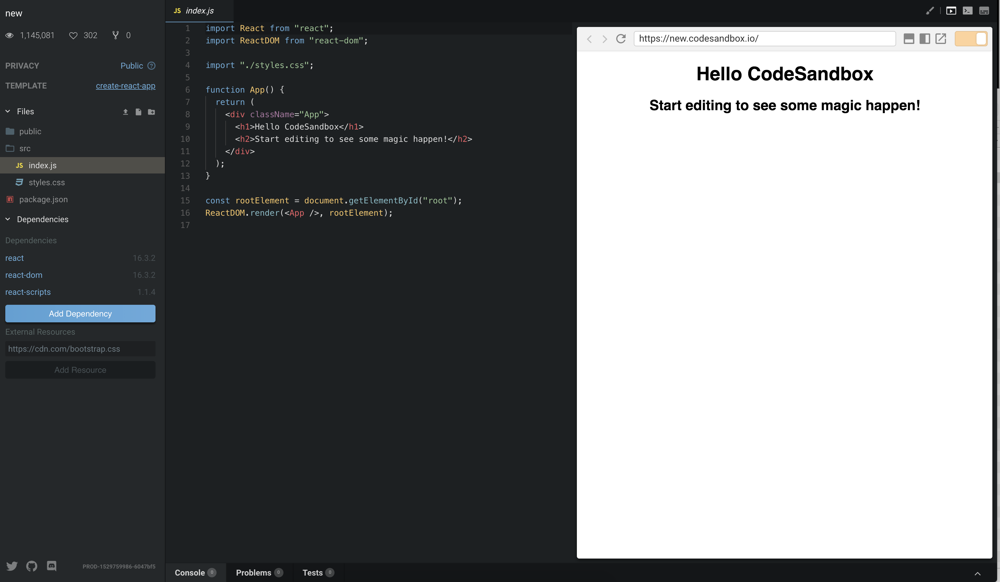
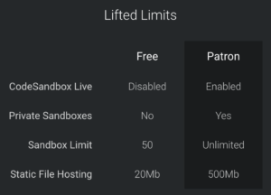

Have you ever gotten a great coding idea or wanted to just quickly prototype some component or feature? I know I have.

But most often I find my self configuring the development environment way too long before I get a single line of code written.

For React projects create-react-app is a good option for kickstarting your project. Although it is a good option it still takes time to create you project and install all the dependencies. Not to mention when the time comes that I want to share for example a single component with a colleague or friend it is a bit tedious to either send a zip file or upload the whole project to Github.

#### Enter Codesandbox.io

I was excited to find out about [codesandbox.io](http://codesandbox.io) that solves many of the problems described above. Codesandbox.io is an online code editor built for web application development. It takes away the configuration that is required before you are able to start writing code. It makes it that you don't even need a laptop to code!

Projects are called sandboxes and currently you can create a sandbox with one of the following setups:

- Vanilla jS
- React
- Vue
- Angular
- Preact
- Svelte
- React TypeScript
- Dojo 2
- CxJS

Codesandbox.io also allows you to import projects directly from Github. Now that's pretty cool!

Basically when you create for example a React sandbox, you get all the configuration and dependency management out of the box and can start to write code right away. You can also add any npm dependencies to your sandbox.

\[caption id="attachment\_236" align="aligncenter" width="3408"\] The sandbox editor view\[/caption\]

Sandboxes can be exported either as a zip file download or you can connect your Github account and push commits and create pull requests directly from codesandbox.io. You can also share your sandbox by just sharing a link to it and anyone can view it and fork it if they wish to make modifications.

Codesandbox.io offers also a "lightweight" version of their editor that is used for embedding sandboxes to other websites.

<iframe style="width: 100%; height: 500px; border: 0; border-radius: 4px; overflow: hidden;" src="https://codesandbox.io/embed/z6ylwn95r4" sandbox="allow-modals allow-forms allow-popups allow-scripts allow-same-origin"></iframe>

Codesandbox.io is free to use. Free version comes with some limitations and they offer paid version through the [patron page](https://codesandbox.io/patron). Currently the free plan has following limitations:

 

#### Conclusion

When it comes to quickly prototyping a feature or sharing a component codesandbox.io is the tool to use for me. I have found it also great when learning a new technology e.g. React because it lowers the learning curve since I don't have to do anything extra to start programming. I was a bit sceptical first about the user experience and thought that it would be laggy compared to traditional local development environment. I was happy to be proven wrong.
