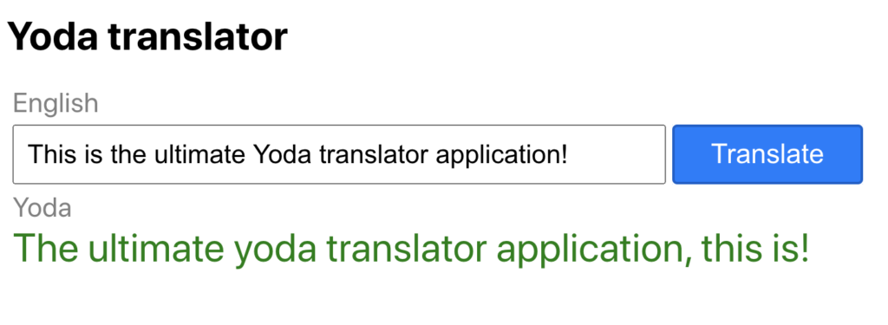

I like Star Wars movies, I like Yoda and I like [coding in React](/blog/react-for-beginners-complete-guide-to-mastering-react-fundamentals/). Well I thought that maybe I could combine these three in my next React project. That's when I got the idea to create a React application that can translate English to Yoda (yodish).

## Planning the application

For translating English to Yoda, I decided to use a [R](https://funtranslations.com/api/yoda)[EST](https://funtranslations.com/api/yoda) [API](https://funtranslations.com/api/yoda) that does all the heavy lifting for us. It is a public API so we don't need any authentication or api keys to use it. We can just send the text as a text parameter and we get the translation as a response.

On the front end I used create-react-app to initialise a React project and then added a simple UI with a text input, button and a couple of labels.

The UI of the finished application.

The text input takes the text we want to translate, the button initialises the API request and the labels are there for… well what are labels usually for.

## Finished application

I recorded the whole process of building the app and uploaded it on YouTube. You can watch the video [here](https://youtu.be/LT8hAGnju9g).

I also got a little creative filming the video and added an intro which I strongly recommend you check out. I think it turned out pretty cool. Let me know in the comments what you think about it!

I also uploaded the finished project to Github if you want to take a look. You can find the project [here](https://github.com/tumetus/yoda-translator-app).

## Conclusion

Even though the app was pretty straight forward and simple to make, I still had a lot of fun making it. And if you are new to React, I recommend watching [the video](https://youtu.be/LT8hAGnju9g) because it teaches the basics on how to use a REST API with React, which itself is a must have tool in a React developers toolbox.
