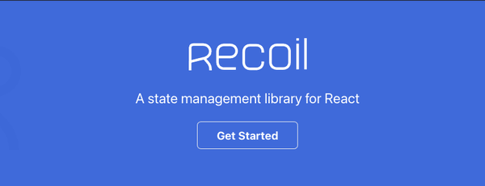

_This article was originally published on [my newsletter](/newsletter) last week. I publish previous week's newsletter here on the blog. If you want to read these as soon as they are published, [sign up](/newsletter) for the newsletter!_

Ahoy,

For the past week I have been diving more into React state management. Especially I have learned more about Recoil and the Context API. I also published a new video on the Youtube channel listing some of my favourite Github repos for developers.

## React Context API vs Recoil

I found myself needing some sort of state management for a small React application. I have previously worked with Redux, but in this case I felt like it would just be overkill to use Redux and I would be better off with something a bit lighter.

So even though there is bunch of different state management options available when it comes to React applications, I decided to test the [Context API](https://reactjs.org/docs/context.html) and [Recoil](https://github.com/facebookexperimental/Recoil).

I was able to create a working "Redux-like" solution using the Context API based on [this](https://kentcdodds.com/blog/how-to-use-react-context-effectively) blog post by Kent C Dodds. It worked well but it still had some boilerplate code that could probably be avoided. So it was Recoil's turn.

Recoil turned out to be super handy and easy to understand. The learning curve was super shallow and I was able to get the hang of it pretty quickly.

With Recoil it was easy to create a new piece of state and then just use it across the application. I'm not going to go any deeper right now on how Recoil works. Let me know if you would like to see Recoil demo or tutorial video and I shall do that.

The downside with Recoil is that it is still "an experimental set of utilities for state management with React.". So using it in production might be a bit sketchy.

I tried to find out if Recoil has some kind of roadmap or information on when they are planning on lifting the experimental status, but with no luck. So I guess time will tell when that is happening.

At first I was a bit sceptical about Recoil, thinking that it might just be "another state management library" but I am happy to be proven wrong.

Regardless of Recoil's experimental status, I am definitely going to keep using Recoil on smaller apps in the future. Given that it is developed by Facebook, it has over 14k stars on Github and bunch of contributors and users, chances are it is not going anywhere and it will keep getting better over time.

I would love to hear your experiences on state management with React apps, what are you using and why? You can [tweet](https://www.twitter.com/tumee) your answer to me.

## Top Github repos for Web developers

As usual, I published one video on the [Youtube channel](https://www.youtube.com/tuomokankaanpaa) this week.

There are bunch of different repos that I use and that have helped me over the time. So in this video I share 7 amazing repositories that will help you as a developer!

You can watch the video below. If you are not yet subscribed to the Youtube channel you can do it from [this link](https://www.youtube.com/channel/UC34UXFLKqdW3cpk5CBu2Siw?sub_confirmation=1). By subscribing you get notified on all the latest videos and it is a great way to show your support for me!

[📹 View on Youtube](https://www.youtube.com/watch?v=UAzWXI_tJyg)

That's it for this week!

Cheers,
Tuomo
