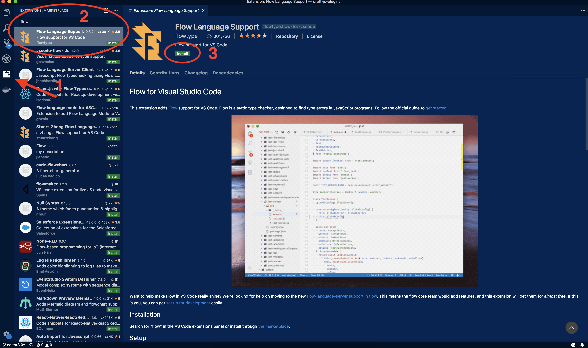

[When first time using flow](/blog/my-first-time-using-flow-for-static-type-checking/), many people use it through terminal. This is fine but there is a better way to implement Flow to your workflow. Many modern text editors and IDEs like Visual Studio Code and Atom offer extension for Flow that runs the Flow checks every time for example a file is saved and displays the errors right at the editor.

In this post I will cover how to setup Flow extension for Visual Studio Code.

## Installation

You should have Flow installed to your project via npm. You can install Flow globally but I recommend installing and configuring Flow per project. I have found this the best way especially when I've been working with open source projects because some projects use different versions of Flow than others and if you have Flow installed globally, this can cause mysterious problems.

In order to show errors in the VS Code we need to install the [Flow Language Support extension for Visual Studio Code](https://marketplace.visualstudio.com/items?itemName=flowtype.flow-for-vscode). You can do this by going to the extensions tab (1) in VS Code and searching for "flow" (2). Click "Install" (3) and after the installation is complete click "Reload".



The extension documentation states that you need a [.flowconfig](https://flow.org/en/docs/config/) file for your project. If you don't already have one, you can generate it by running "flow init".

Note that if you don't have Flow installed globally, you need to run Flow from your project directory with "_node_modules/.bin/flow init_".

The docs also state that you should disable the built-in TypeScript extension for your project. I found this unnecessary and the Flow extension seemed to be working just fine without disabling the built-in TypeScript extension.

Next let's open a file that is marked as Flow file (has // @flow in it). If you didn't install Flow globally, you should get the following error.


We can fix this by adding *flow.pathToFlow* variable with appropriate value to VS Code workspace settings. Open workspace settings by typing "workspace settings" to the command palette (Cmd+Shift+P on Mac and Ctrl+Shift+P on Windows).


Add the following line to the json config file.

```json
"flow.pathToFlow":"${workspaceRoot}/node_modules/.bin/flow"
```


Now when you open the Javascript file again the you should see Flow errors nicely in the VS Code editor. If you still get the "cannot find flow" error, make sure that the value for *flow.pathToFlow* is correct and reload your VS Code.

## **Update 11/2018**

If you are using newer version of VS Code you might see a settings UI instead of the json file. In that case you can find the setting under **Extensions** -> **Flow Configurations**. See the screenshot below.


## Conclusion

Adding the extension for Flow to VS Code is pretty much a must if you work with Flow and VS Code. The ability to see the errors right in the editor speeds up the development tremendeously compared to running Flow from terminal.

If you have any questions related to Flow and VS Code please leave them in the comments and I'll be sure to answer them!
