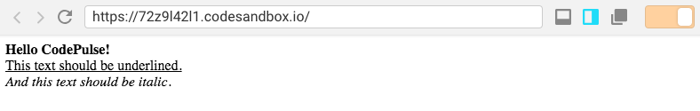

When looking through Draft.js docs there is much talk about how you can modify the editor's state in many different ways. Draft.js also provides us with `convertToRaw` function that we can use to convert the state to plain JSON. But there is little information on how to actually display Draft.js content. Do you need to implement some custom parsing for the state JSON? Or is there some existing library or way to take the state JSON and display it nicely?

_I just published a class where I teach more about Draft.js. Best part is that you can get it for free! [Read more](/blog/rich-text-editing-in-react-with-draft-js-course/)._

This is what the [docs](https://draftjs.org/docs/api-reference-data-conversion) say about displaying the content: "_Note that the Draft library does not currently provide utilities to convert to and from markdown or markup, since different clients may have different requirements for these formats. We instead provide JavaScript objects that can be converted to other formats as needed._"

So Draft.js provides utility functions for converting the state to raw JS (`convertToRaw`) and raw JS to ContentState object (`convertFromRaw`) but not to markdown or markup. This has led to birth of separate markdown/markup converting libraries. I wrote a post on how to use one of these libraries to [display Draft.js content as HTML](/blog/how-to-display-draft-js-content-as-html/).

## Using the Draft editor for display

Converting the state JSON to a markdown/markup is not however the only way to display your state. Another way is to initialise a Draft.js editor with the saved state JSON and put the editor into `readOnly` mode. This way the editor component will handle all the styling and there will less likely be bugs or inconsistencies in the styling of the contents than there would be when using external converting libraries because the converting is done by Draft.js itself. Here is an example on how to do that.

For the purposes of this example we are going to load the stored state from a JSON file. Our `storedState.json` file looks like this:

```json
{
  "blocks": [
    {
      "key": "8i090",
      "text": "Hello CodePulse!",
      "type": "unstyled",
      "depth": 0,
      "inlineStyleRanges": [
        {
          "offset": 0,
          "length": 16,
          "style": "BOLD"
        }
      ],
      "entityRanges": [],
      "data": {}
    },
    {
      "key": "42ncd",
      "text": "This text should be underlined.",
      "type": "unstyled",
      "depth": 0,
      "inlineStyleRanges": [
        {
          "offset": 0,
          "length": 31,
          "style": "UNDERLINE"
        }
      ],
      "entityRanges": [],
      "data": {}
    },
    {
      "key": "327r6",
      "text": "And this text should be italic.",
      "type": "unstyled",
      "depth": 0,
      "inlineStyleRanges": [
        {
          "offset": 0,
          "length": 31,
          "style": "ITALIC"
        }
      ],
      "entityRanges": [],
      "data": {}
    }
  ],
  "entityMap": {}
}
```

Here is the actual component that we use to display the stored state:

```jsx
import React from "react";
import ReactDOM from "react-dom";
import { Editor, EditorState, convertFromRaw } from "draft-js";
import storedState from "./storedState.json";

class App extends React.Component {
  render() {
    const contentState = convertFromRaw(storedState);
    const editorState = EditorState.createWithContent(contentState);
    return (
      <div className="App">
        <Editor editorState={editorState} readOnly={true} />
      </div>
    );
  }
}

const rootElement = document.getElementById("root");
ReactDOM.render(<App />, rootElement);
```

On the lines 3 and 4 we import everything related to Draft.js and also the stored state (again, we import the state from a file to keep this example simple).

In the render method we create a `contentState` object by passing the JS object for the state as a parameter for `convertFromRaw` method (line 8). Once we have the `contentState` object we create an `editorState` object out of it with `EditorState.createWithContent` (line 9).

Finally we render our `Editor` component with the `editorState` we just created (line 12). We also set `readOnly={true}` for the editor component so it is displayed nicely and the content cannot be modified.



You can find a codesandbox for this example [here](https://codesandbox.io/s/72z9l42l1).

## Conclusion

As we saw using the Draft editor component with readOnly set to true, it is quite simple to display Draft.js content. You don't necessarily need to convert the state to e.g. HTML or markdown in order to display it. I must add though that I am not sure if this is the most optimal way of displaying Draft.js content. What I can say is that I have used this approach in projects that are in production and it has worked well for me.

If you have an idea of another approach or have used a different solution for displaying Draft.js content, please leave a comment below! I would like to hear from you! And of course if you have any questions or thoughts be sure to comment them below too!
