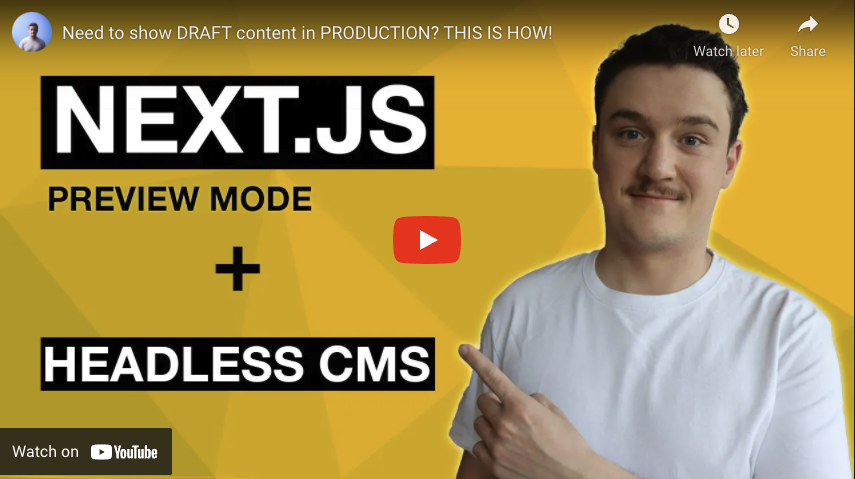
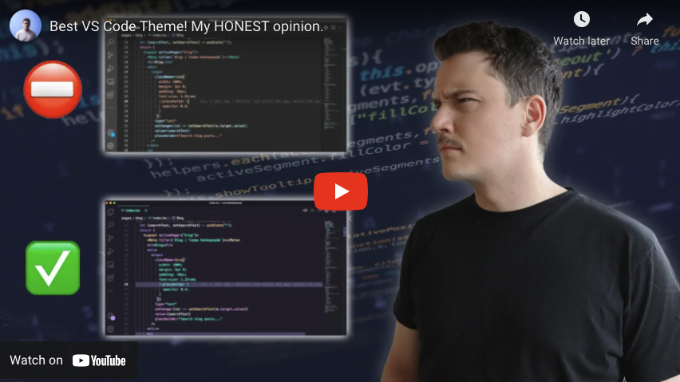

_This article was originally published on [my newsletter](/newsletter). If you want to stay up to date and read these as soon as they are published, [sign up](/newsletter) for the newsletter!_

Ahoy,

Winter has come to Finland. It has been snowing a lot and the temperature has been around -15C for the past week or two. Although I love that there is snow (helps with the darkness) and cold weather in December, I have been mostly staying inside and doing a lot of coding lately.

On top of coding, I have been planning to do one or two Next.js videos before the end of the year. As always, if you have any wishes or suggestions on what kind of videos you would like me to do, let me know (reply this email or [hit me up on Twitter](https://www.twitter.com/tuomokankaanpaa))!

## Latest Youtube videos

As always, I have been uploading one video per week on my [Youtube channel](https://www.youtube.com/tuomokankaanpaa). Here are the latest videos from the channel since my last email.

### Need to show DRAFT content in PRODUCTION? THIS IS HOW!

This is part 3 of the unofficial "Building a blog with Next.js" series.

In this part we add possibility to view draft blog posts from the headless CMS in production environment. So there is no need for a preview or staging environment and it enables you (or who ever writes the blog posts) to preview the posts in the environment they will be shown for end users.

This is possible with the Next.js Preview feature. Preview feature is one of the less talked about features in Next.js. I also think it is kind of underrated, even though it makes it possible to easily implement the draft content viewing feature, which is in my opinion crucial for every blog application.

### Best VS Code Theme! My HONEST opinion.

I have been looking for a nice new theme for my VS Code and I think I've finally found one that I really like. You might have seen me using it already in some of the previous videos since I've been testing it out for some time now.

So in this video I want to share with you this theme I currently use in my VS Code. Even though I really love this theme, I reserve the right to change my opinion in the future if I come across an even more awesome theme 😂

That's all for this week!

Cheers,
Tuomo
