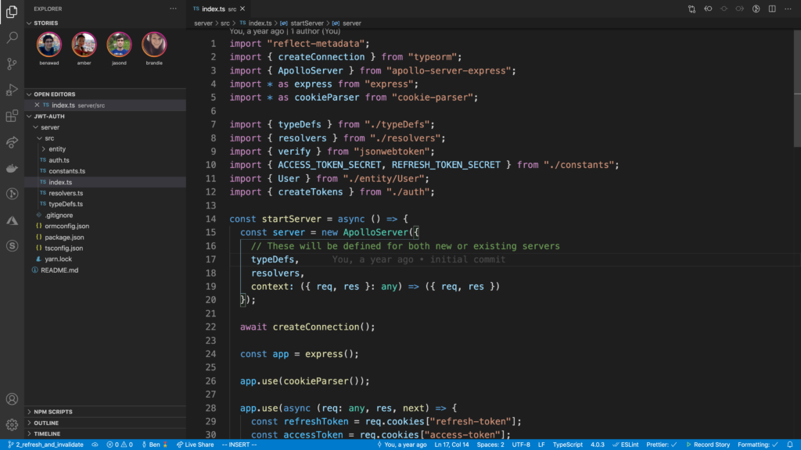

_Do you ever just wake up in the morning, open up VS Code, and think to yourself "Wow I wonder what other coders are doing around the world, what are they coding on?"._

That's how Ben Awad starts his [video](https://www.youtube.com/watch?v=ApR-kNXxLUs) where he introduces VS Code stories, an extension for [Visual Studio Code](/blog/top-10-keyboard-shortcuts-for-visual-studio-code/) which adds stories to VS Code.

He literally created an extension for VS Code that you can use to view Instagram like stories and upload your own ones for others to see. I think this was just hilarious and at the same time super awesome!

If you haven't already, be sure to check out the extension and his [video](https://www.youtube.com/watch?v=ApR-kNXxLUs) introducing the extension, it is hilarious! All the code for the extension is [open source](https://github.com/benawad/vscode-stories).

That's all for now, I just wanted to share this with you guys because I think this was super funny and worth showcasing extension.

Comment below what do you think about the stories for VS Code?
