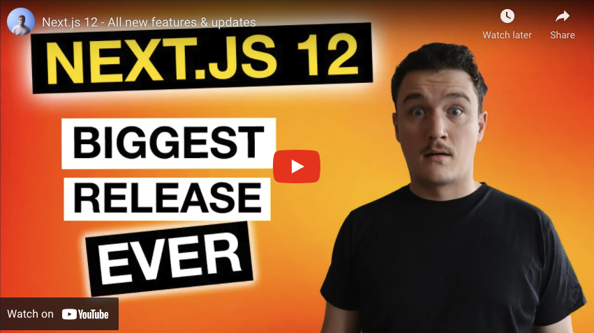

_This article was originally published on [my newsletter](/newsletter) last week. I publish previous week's newsletter here on the blog. If you want to read these as soon as they are published, [sign up](/newsletter) for the newsletter!_

Ahoy,

Past week was full of web development and Next.js!

## Next.js + Headless CMS + GraphQL - Next.js tutorial for beginners

[📹 View on Youtube](https://www.youtube.com/watch?v=_VIF1if-dNA)

I released an extensive Next.js tutorial which was almost an hour long. I have never done a tutorial this extensive before. It was great to be able to finally release it because I had been working on it quite a lot.

The tutorial teaches you how to integrate a headless CMS to a Next.js blog application. This was a part 2 for the "[Building a blog with Next.js - Next.js tutorial for beginners](https://www.youtube.com/watch?v=giHGL3ZppTQ)" tutorial I mentioned in the newsletter [couple of weeks ago](https://tuomokankaanpaa.com/blog/how-to-build-a-blog-with-next-js).

You can find the tutorial (both part 1 and part 2) from the [Youtube channel](https://www.youtube.com/tuomokankaanpaa).

## Next.js Conf

[Next.js conf](https://nextjs.org/conf) 2021 was held on 26.10.2021. I watched the conference live and was really excited about all the new things that were announced. Here are some highlights.

### Next.js 12

[📹 View on Youtube](https://www.youtube.com/watch?v=S9jrLAyVvx4)

First of all Next.js 12 was announced which is their biggest release ever. With Next.js 12 we get faster build and fast refresh times, URL imports, Native ES Modules support and Next.js Middleware just to mention few.

If you want to learn more about Next.js 12, I made a video detailing and explaining all the new features and improvements of Next.js 12. You can watch it on the [Youtube channel](https://www.youtube.com/tuomokankaanpaa).

### Vercel edge functions

[📹 View on Youtube](https://www.youtube.com/watch?v=NlBSheYPKkg)

Another thing that was announced in the Next.js conf was [Vercel Edge functions](https://www.vercel.com/edge).

This is how edge functions are described by the [docs](https://vercel.com/docs/concepts/functions/edge-functions): To achieve both speed and dynamism, you can use Edge Functions. They allow you to deliver content to your sites visitors with speed and personalization, are deployed globally by default on Vercel's Edge Network, and have zero cold starts. They enable you to move server-side logic to the Edge, close to your visitors origin.

These were a bit hard for me to first understand at first when watching the conference. After the conference I started to study them in more in depth. After some hours spent drinking coffee and reading docs and testing different things, I finally was able to wrap my head around them.

At this point I felt that I wanted to make a video sharing what I had learned. So I published my third video of the week: [Next.js 12 - Middleware & Edge functions explained](https://www.youtube.com/watch?v=NlBSheYPKkg).

In the video I also explain what the new Next.js 12 feature Middleware is because it is actually something that works together with Edge functions.

## Wrapping it up

So as you can see, it was a pretty busy but exciting week! I am super excited that I was able to make the videos about Next.js 12 and Edge functions + Middleware this week, on top of my regular Tuesday video.

It is also encouraging that the videos got a really good response and you guys have really liked them! So I want to say thank you for all the comments and likes you have sent!

That's all for this week!

Cheers,
Tuomo
