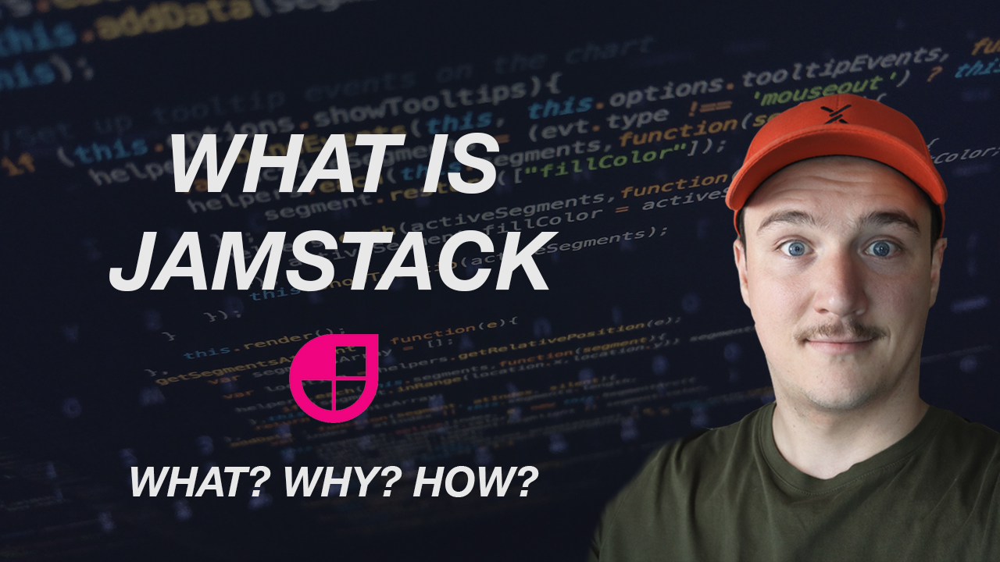
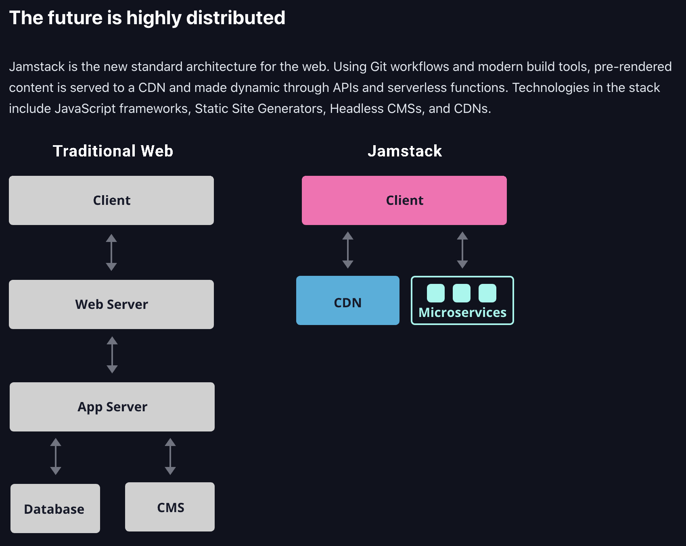

I first heard the term _Jamstack_ at the end of last year. Since then I have studied it and gained a basic understanding of how to actually build websites using Jamstack. (I actually updated and wrote [my website](https://www.tuomokankaanpaa.com) using Jamstack).

In this blog post I have collected answers to the following questions

- What is Jamstack?
- What are the benefits of using Jamstack? (aka why to use it)
- How to get started with Jamstack?

_If you prefer a video over text, I created a video of this blog posts which you can watch [here](https://www.youtube.com/watch?v=S6Mtfsl17PQ)._

## What is Jamstack?

The name Jamstack comes from Javascript, APIs and Markup. It is an architecture designed to make the web faster, more secure and easier to scale.

This is done by using pre-rendering and decoupling. Frontend of a Jamstack site is pre-built and pre-rendered at build time to a highly optimized static pages. There are a bunch of [popular tools](https://jamstack.org/generators/) for generating sites, like [Next.js](https://nextjs.org/), [Gatsby](https://www.gatsbyjs.com/) and [Eleventy](https://www.11ty.dev/), to mention few.

These pages can then be delivered with a CDN and there is no need for traditional dynamic web server. This makes the sites fast, cost efficient and highly scalable.

Here is a great diagram from [jamstack.org](https://www.jamstack.org) comparing Jamstack sites to traditional websites:

## What are the benefits of using Jamstack?

Here is few of the benefeits that come with Jamstack sites.

### Performance

In this day and age user's attention span is super short. If a web page has even a little bit of lag, you have a big chance of losing the user. With Jamstack sites this is not a problem. Since Jamstack sites are static sites hosten on CDN, they are super fast.

Jamstack sites don't require the server to generate the site once a request hits the server. Because the site is pre-generated in build time, the server only has to serve the static file. So we get super good performance without massive, expensive and complex server infrastructure.

### Security

The attack surface is quite small with Jamstack sites. Since we are just serving pages and assets as pre-generated files, this allows a read-only hosting which reduces the attack surface even further.

### Scale

If we are getting a huge traffic spike, we can increase our CDN volume to handle the new traffic. Even a huge traffic spikes don't slow down Jamstack sites.

You also don't have to add any caching logic for popular views and assets by yourself. Jamstack provides this by default if you are hosting the site on a CDN.

### Maintainability

Since Jamstack sites are hosted on a CDN, you pretty much don't have any server maintenance tasks. All the work is done in build time and after that you serve the site (the static files) from a CDN, you really don't need any servers that might require updating or other maintenance. The site is stable.

### Portability

Jamstack sites are pre-generated making them easy to host. You can use any kind of static hosting solution to host your site.

### Developer experience

Developer experience with Jamstack is top noch. With Jamstack it is very fast and pleasant to work with and you can use wide variety of popular and modern tools and frameworks. This also guarantees that it shouldn't be too hard to find people that want to work with Jamstack.

## How to get started with Jamstack?

I recommend using a site generator to get started with your first Jamstack site. I personally have used [Next.js](https://nextjs.org/) and [Gatsby](https://www.gatsbyjs.com/). Next.js offers a bit more functionality compared to Gatsby. With my limited experience with Next.js and Gatsby, I prefer Next.js. That is what I also use with my own [website](https://www.tuomokankaanpaa.com).

So if you are familiar with Javascript and React, I recommend going with Next.js. They have a [great tutorial](https://nextjs.org/learn/basics/create-nextjs-app) up on their site where you actually build a blog.

Next.js also integrates nicely with [Vercel](https://www.vercel.com) so deploying your application is super effortless.

## Conclusion

Jamstack is a great and modern way for building websites. I will be using it for sure in my future projects.

If you want to get started with Jamstack, there is no better way to learn a new technology than to use it. So go ahead and create something with it. I recommend the [Next.js blog tutorial](https://nextjs.org/learn/basics/create-nextjs-app) for starters.
